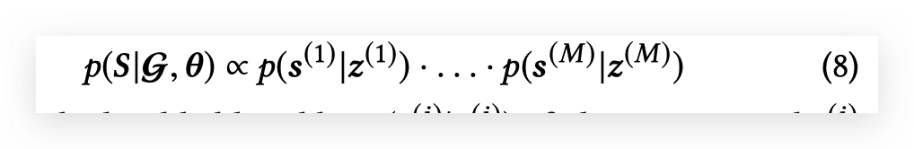
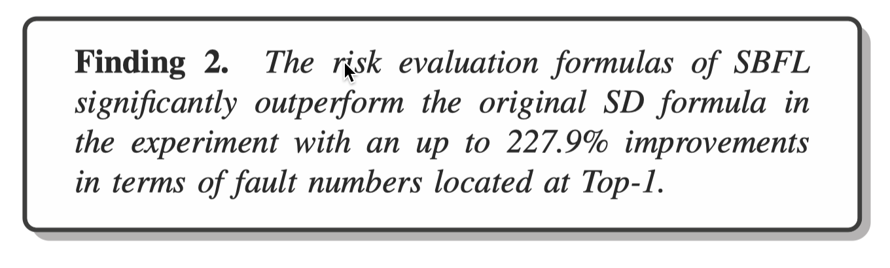
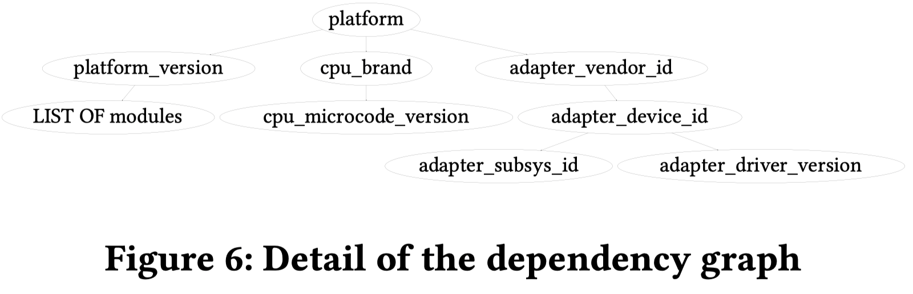
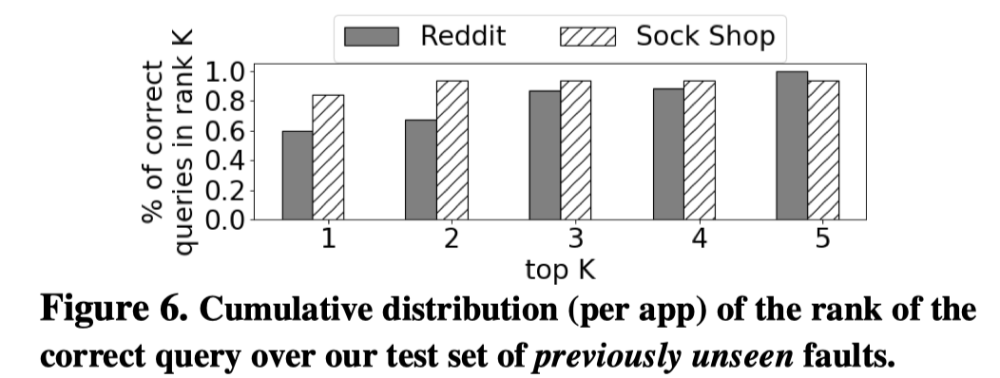

---
share: true
tags:
  - Paper Notes
  - TSE
  - "2013"
  - SBFL
---

# Key Results

The five formulas in ER1 and ER2 are local maximals.

# Introduction

Existing approaches mostly select the best SBFL techniques using empirical methods. However, no matter how the researchers standardize their experimental setup or vary the setup choices, their investigations could never be considered as sufficiently comprehensive.

Some researchers have conducted theoretical analysis. Naish et al. propose two best formulas with theoretical proof, but they did not use the commonly used evaluation measurement.

This work proposes an innovative framework to analyze SBFL techniques theoretically, which considers the number of statements with higher risk values than the faulty ones.

Based on which, this work analyzed 30 risk evaluation formulas.

# Framework

This work assumes there is only one faulty program element (e.g., statement).

EXAM score: the percentage of program elements that need to be examined before the faulty ones.

Since tie-breaking schemes solve a problem that risk evaluation formulas cannot solve. It is reasonable to assume that the tie-breaking scheme  in our analysis is consistent in all risk evaluation formulas

Two formulas are equivalent if and only if they have the same number of statements preceding the faulty statement in the ranking lists, that is, they produce the same EXAM score

To to better relationship, we need not to consider S_F when the tie-breaking scheme is consistent.

These assumptions are also the main limitation of this work

# Takeaways

在trace根因定位的场景下，这些结论的参考意义有限。因为在我们的场景中，不经过根因的trace也有问题是很常见的，因此类似naish1或者binary这种绝对是效果很差的。

在program debugging中的文章中，实验结果也有和这里的结论不一致的地方。比如PRFL中，Ochiai就比Kulczynski更好。可能是因为他们用的评测指标不是EXAM，有些细微的不同？