## 导读

搜索引擎、在线视频和电子银行等在线服务系统在人们的日常生活中有着越来越重要的作用。但是，由于在线服务系统包含众多有着复杂依赖关系的组件（例如服务器、容器和微服务等等），在线服务系统中的故障难以避免，并且难以进行故障定位。本文介绍清华大学 NetMan 实验室在软件工程顶级会议 ESEC/FSE 2022 发表的一篇论文， Actionable and Interpretable Fault Localization for Recurring Failures in Online Service Systems。

该论文提出了一种可操作、可解释的面向在线服务系统中重复类型故障的故障定位方法，DéjàVu。DéjàVu的名字来自一个法语短语 déjà vu，意思是似曾相识。DéjàVu 采用了一种基于图神经网络的定位模型，该模型以故障发生时在线服务系统中各个组件的监控指标和组件间的依赖关系作为输入，输出故障的位置和类型给运维人员。同时，该论文还提出了两种提供可解释性的方法。实验结果表明DéjàVu可以将真正的故障根因平均排序到第 1.66~5.03 名，优于对比算法 54.52%∼97.92%，并且具有良好的时间效率和泛化性。

该论文的代码和数据都已开源在 GitHub 上：[NetManAIOps/DejaVu: Code and datasets for FSE'22 paper "Actionable and Interpretable Fault Localization for Recurring Failures in Online Service Systems" (github.com)](https://github.com/NetManAIOps/DejaVu)
论文原文的链接是 [[https://netman.aiops.org/wp-content/uploads/2022/11/DejaVu-paper.pdf]]

## 背景

### 在线服务系统
在线服务系统包含数量众多的各种类型的组件，例如服务器、容器、数据库和微服务等。这些组件之间有着复杂的依赖关系，主要包括调用关系和部署关系两类。下图展示了一个小型微服务系统（称为系统 A）中 OSB、服务和数据库之间的调用关系，以及 OSB、服务、容器和服务器之间的部署关系。
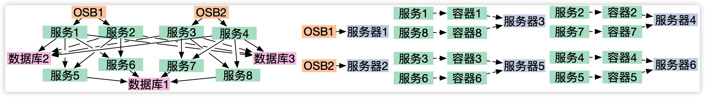
为了监控这样复杂的系统，运维人员在各种组件上会配置许多监控指标，这些监控指标以24 × 7的模式监控组件的状态，一般被认为是故障的最直接的信号。例如，下表展示了 系统 A 中不同类型的组件上的各类监控指标。
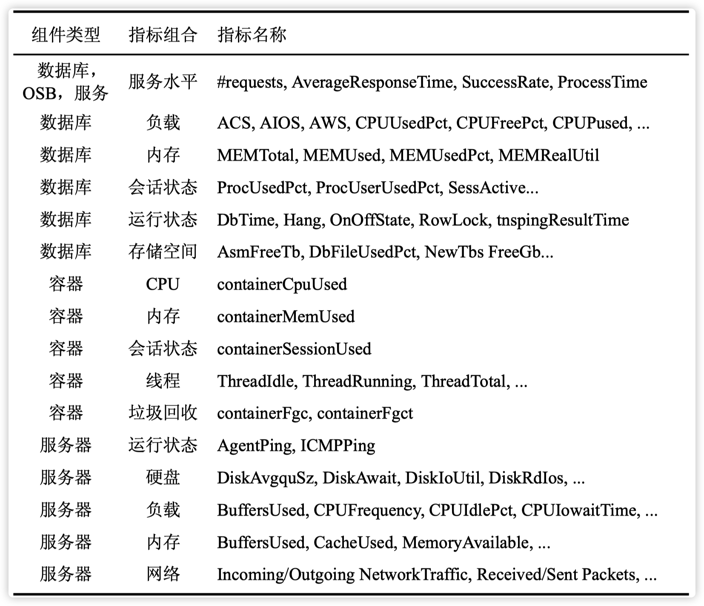

### 可操作故障定位

故障定位问题可以有不同的定位范围（Scope），从高层次到底层次，可以定位到不同粒度的结果。一方面，因为在线服务系统中故障的复杂性，根因是非常多样的（例如，业务代码bug、人员操作失误、硬件故障、网络波动、第三方服务失效等等），自动化找到最根本的原因非常困难。另一方面，进行故障止损往往并不需要具体的根因，而故障修复的时效性并不迫切。例如，一次由内存泄露引起的故障，运维人员只需要知道哪台服务器出现了内存不足的问题，就可以通过重启服务器、迁移服务等等手段进行止损，而不需要知道具体导致内存泄漏的进程、代码等真正的根因。
现有的故障定位方法往往聚焦于不可操作的粒度，例如单个指标或者组件。单个指标粒度过细，例如如果仅仅定位到内存使用率，运维人员很难确定具体是什么导致了内存不足，是内存泄露还是流量过高。单个组件粒度过粗，运维人员也还需要进一步的故障定位才能采取止损操作。DéjàVu聚焦于定位到可操作的粒度，即运维人员可以立即采取故障止损操作的粒度。DéjàVu将此定义为“在哪里发生了什么故障”，即故障位置（即组件名称）和故障类型的组合。为了方便，可以称一个组件和其上一种故障类型的组合为一个故障单元，所以DéjàVu的定位目标就是根因故障单元。

### 重复类型故障

由于错误或者不及时的故障修复措施、 高使用率导致的问题以及硬件故障等等原因，故障可能重复发生。论文称这样在不同位置发生的、由相同类型根因导致的故障为重复类型故障（Recurring Failures）。该论文调研了一家商业银行一年时间的576 个真实故障，如下图所示，不同的系统中重复类型故障的比例都很高。重复类型主要包括外部原因、硬件原因和中间件原因， 比如非法请求、第三方服务不可用、磁盘损坏、低效的 SQL 查询和数据库索引缺失等等。非重复类型主要是逻辑原因，比如代码缺陷、流程设计缺陷、数据问题 （例如手工维护促销优惠商户名单时操作失误）等。因为重复类型故障的大量存在，DéjàVu 仅面向重复类型故障进行故障定位已经足够重要。
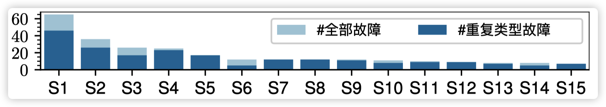
## 主要方法
DéjàVu 的工作流程如下图所示。当一个故障事件发生时，监控系统触发 DéjàVu 进行故障定位。DéjàVu使用当前时刻的监控指标和故障依赖图（FDG，在下文中详细介绍）作为输入，输出根因故障单元和对应的解释给运维人员。运维人员完成故障处理之后，将真正的根因记录到历史故障数据库中，用于之后更新定位模型。
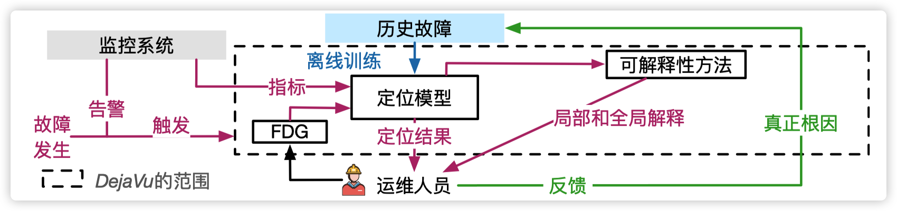
### 故障依赖图

基于历史上发生过的故障（“发生过”意味着相同类型故障再出现时就是重复类型故障），运维人员可以总结出每种类型的组件上可能会发生什么类型的故障，并且将故障类型的粒度设定为令自己足以马上采取止损操作的粒度。基于此，通过组合所有的组件和对应的故障类型，可以得到一个在线服务系统中所有已知的故障单元。基于组件间的调用关系和部署关系，可以将这些故障单元连接起来，组成一张故障依赖图。下图展示了系统 A 的故障依赖图（局部）。
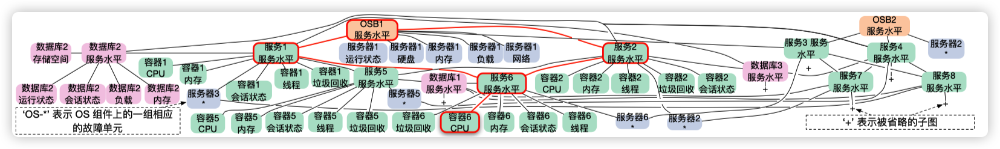

由于在线服务系统中可能会频繁发生硬件、软件或者配置的变更，因此故障依赖图也会经常发生变化。所以，DéjàVu 会在每次故障事件发生时构建一次故障依赖图。

每个故障单元的输入特征是对应的组件上，和该类故障相关的监控指标。例如，对于“服务器 1 服务水平”这个故障单元，对应的输入特征就是服务器 1 上反映服务水平的若干个指标：平均响应时间、成功率和 QPS。每类故障需要哪些指标作为输入，应该由运维人员在定义重复发生的故障类型时一并总结。
### 定位模型设计
DéjàVu的定位模型采用了一种二分类的框架：它为每一个故障单元输出一个0 到 1 的根因分数，表示该故障单元是根因的可能性。相比于多分类（为整个故障依赖图输出一个 softmax 的向量），二分类的框架可以让模型在不同位置的同类故障上共享模型参数，从而获得更好的泛化性。
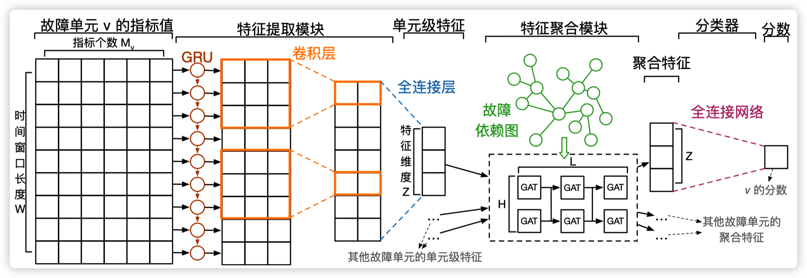
首先，DéjàVu 使用 GRU 和 CNN 将一个故障单元的指标编码为一个固定长度的向量（所有的故障单元编码到相同的维度）。为了泛化性，同一类的故障单元共享同一个特征提取模型。
然后，DéjàVu 使用 GAT 将当前故障单元在故障依赖图上的结构信息，以及邻域内其他故障单元的特征聚合到一起，以建模故障在不同故障单元上传播的模式。为了建模多跳的故障传播，DéjàVu采用了多层的 GAT。
最后，DéjàVu 使用一个全连接网络为聚合特征计算一个根因分数。为了泛化性，该全连接网络在所有的故障单元间共享。

DéjàVu 将所有故障单元按根因分数降序排序，推荐给运维人员。运维人员可以从前往后依次排查最有可能的根因故障单元。

### 可解释性
一方面，为了解释单次定位结果，作者希望给出 DéjàVu 是从哪些历史故障中学到给出当前的定位结果的。为此，作者提出了一种基于 DéjàVu 给出的聚合特征计算故障之间相似度的方法。据此，DéjàVu 可以把和当前故障最相似的历史故障推荐给运维人员。运维人员可以根据这些历史故障对应的工单，理解故障现象和根因之间的联系，并参考其止损方案。

另一方面，为了解释 DéjàVu 模型本身，作者提出使用一组决策树（一种可解释的机器学习模型）模拟训练好的 DéjàVu 模型，尽可能逼近（而不是超越）其结果。然后将这些决策树作为对 DéjàVu 模型的解释。这在可解释机器学习领域被称为 surrogate models 方法。

## 实验评估

### 数据集

如下表所示，该论文在四个系统上进行了实验，包含三个真实系统和一个开源的微服务基准系统，Train-Ticket（https://github.com/FudanSELab/train-ticket）。
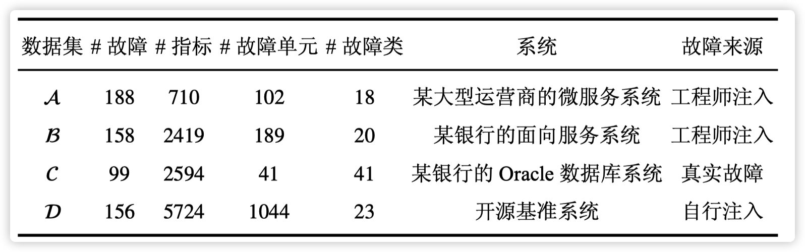
在数据集 A、B 和 D 中，故障事件是通过故障注入的方式生成的，常见的故障注入方式包括 CPU 过载、网络延迟和网络丢包等。

### 定位准确率
该论文同若干类故障定位方法中最新的工作进行了对比，部分结果如下图所示
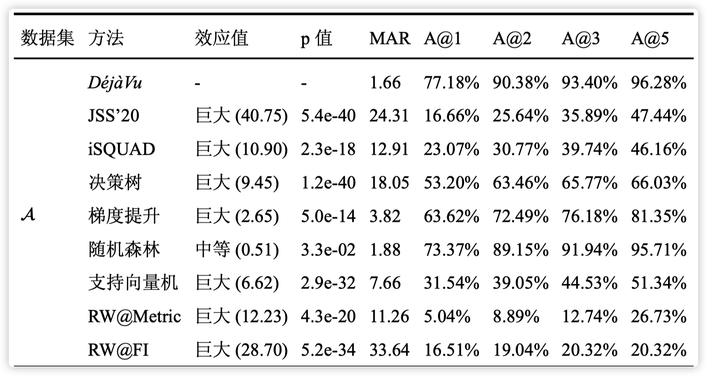
其中，MAR 表示 DéjàVu 为每个故障根因给出的平均排名，A@k 表示 DéjàVu 给出的前 k 个推荐故障单元中包含真正根因的概率。效应值（Cohen's d，参见下图或者 [[https://www.wikiwand.com/en/Effect_size#Cohen's_d]] ）和 p 值（t-test，小于0.05即显著）表示 DéjàVu 相比于对比算法提升的统计显著性，都是基于 MAR 进行计算的。
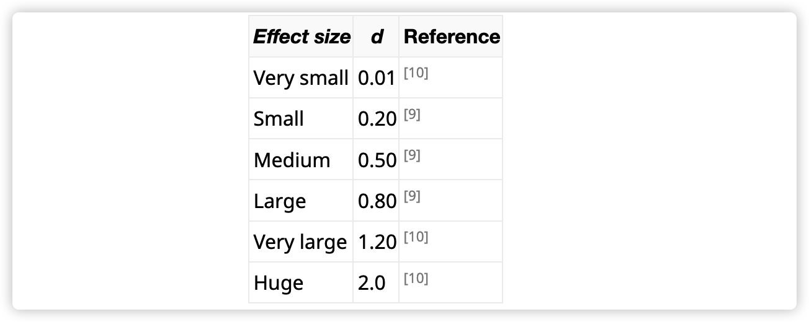

在各个数据集上，DéjàVu 的 MAR 达到了 1.66∼5.03，优于对比算法 11.84%∼99.41%。DéjàVu 的 MAR 平均可以达到 2.82，低于对比算法 54.52%∼97.92%。总的来说，DéjàVu 能够取得良好的故障定位性能，并显著超 越对比算法。

### 时间效率
如下图所示，DéjàVu 为每个故障进行故障定位的时间开销极小，可以忽略。DéjàVu 的训练开销大约是几十分钟到几小时，完全可以接受。这是因为 DéjàVu 模型实际上非常小，一般只有几万参数。另外，训练是离线进行的，不会影响故障定位的时效性。
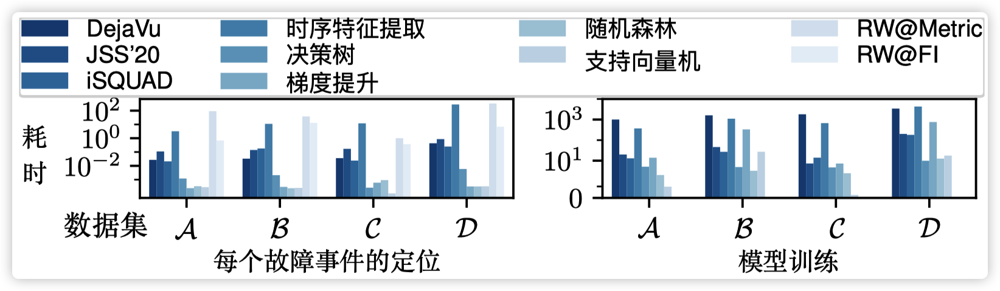
值得注意的是，传统的机器学习模型（决策树、梯度提升、随机森林和支持向量机）需要依赖非常耗时的时序特征提取。因此虽然随机森林等模型的定位性能还不错，但是其并不实用。

### 泛化性
如下图所示，DéjàVu 在历史故障中出现过和未出现过（存在同类故障，但是同一位置上未出现过该类故障）的故障事件中都能为根因给出很低的排名，并基本都显著优于对比算法。
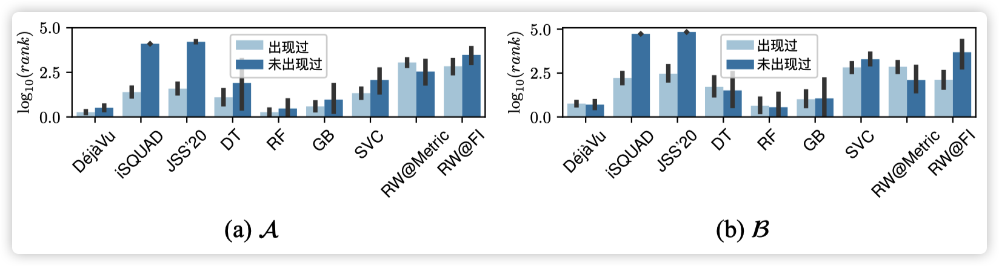

## 可复现性（Reproducability）
该论文的数据集、代码和用于构建 Train-Ticket 数据集的代码都已经开源：[[https://github.com/NetManAIOps/DejaVu]]

在每个数据集中，有几个关键的文件：
- `faults.csv` 记录了所有故障时间的时间和根因
- `graph.yml` 描述了故障单元的定义和 FDG 的结构
- `metric.csv`和`metrics.norm.csv`是所有的指标，其中后者是前者归一化后的结果，DéjàVu 需要读取后者。
后缀为`pkl`的文件是 Python pickle输出的文件，仅用于加速读取。`FDG.pkl`是代码中 `FDG` 类通过 pickle 输出的结果，里面集成了 FDG 、指标和所有的故障

运行代码可以参考 README 文件中的说明，如下图所示。
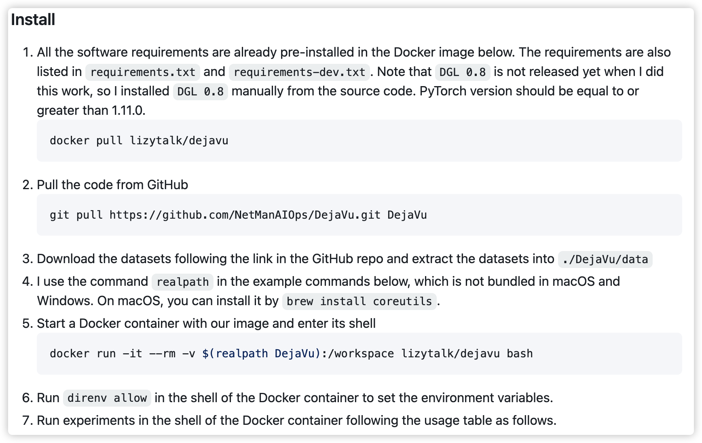
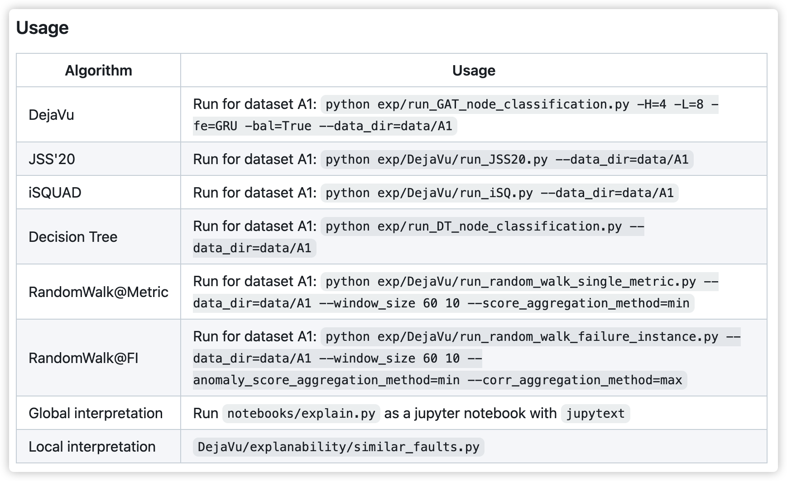

用于构建 Train-Ticket 数据集的代码位于单独的 GitHub 仓库中：[lizeyan/train-ticket: Train Ticket - A Benchmark Microservice System (github.com)](https://github.com/lizeyan/train-ticket)
- `deployment/kubernetes-manifests/k8s-with-jaeger` 中包含了如何在一个k8s集群上部署所有的组件的说明和对应的配置文件
- `FDG_data_collection/` 包含收集指标数据的脚本
- `workload/` 包含生成流量的脚本

## 讨论

- 该论文聚焦于在线服务系统中的可操作故障定位问题，并提出了一种面向重复类型故障的可操作、可解释定位方法，DéjàVu。和此前的故障定位工作不同，DéjàVu将定位目标限定在了“性价比”最高的"可操作"层次。
- 基于对实际系统的调研，DéjàVu 仅面向重复类型故障进行故障定位。实际上，对于非重复类型故障，我们也不太可能让算法给出一个从来没出现过、没定义过的故障类型。但是在实际系统中，非重复类型故障仍然是经常出现的，此时 DéjàVu 给出的定位结果是不可信的。对此，我们可以借助 DéjàVu 中提出的计算故障相似度的方法，如果当前故障和所有历史故障都不太相似，那么它就很可能是非重复类型故障，我们可以通知运维人员采用其他方法得到的定位结果而不依赖 DéjàVu 。
- DéjàVu的定位模型通过共享参数以及使用结构无关的网络（即 GAT）等方式实现了泛化性。泛化性对于在线服务系统中的故障定位非常重要。因为庞大的规模，在线服务系统中可能有大量的同类组件，其中一个组件上发生的故障可能在其他同类组件上发生，并引起类似的症状。但是在许多其他领域的故障定位工作中不需要考虑这点。
- DéjàVu目前仅仅将指标作为故障单元的输入特征。通过神经网络，可以比较容易地融合日志等多模态数据作为故障单元的输入特征。
- DéjàVu存在的一个局限性是难以表征未知的故障类型。因为目前故障单元的定义依赖已知的故障类型和对应的指标组。但是如果发生的故障是新类型时，描述已知类型故障的指标不一定能描述新类型故障，那么此时用已知故障单元的聚合特征计算故障相似度就可能存在问题。如果用每个组件上的所有指标作为输入特征，那么输入维度会过高，难以训练模型。

## 总结
本文介绍了在线服务系统中一个面向重复类型故障的可操作故障定位方法，DéjàVu。由于篇幅所限，本文没有涉及过多的细节，详细内容请查看原论文。
论文名称：Actionable and Interpretable Fault Localization for Recurring Failures in Online Service Systems
论文作者：Zeyan Li, Nengwen Zhao, Mingjie Li, Xianglin Lu, Lixin Wang, Dongdong Chang,  Xiaohui Nie, Li Cao, Wenzhi Zhang, Kaixin Sui, Yanhua Wang, Xu Du, Guoqiang Duan, Dan Pei
论文地址：[[https://netman.aiops.org/wp-content/uploads/2022/11/DejaVu-paper.pdf]] 或者 [[https://dl.acm.org/doi/abs/10.1145/3540250.3549092]]