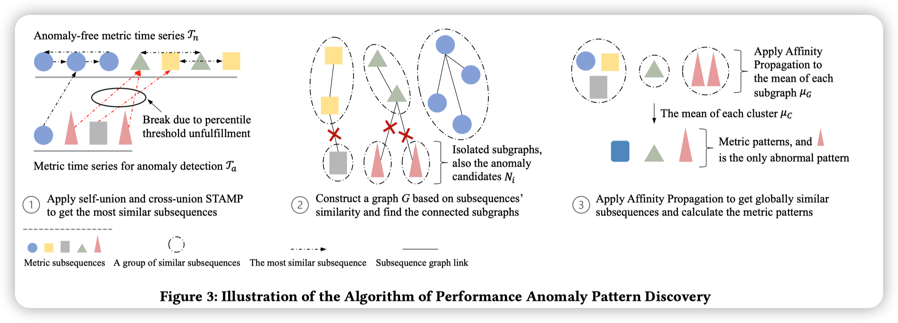

这篇文章聚焦于检测现代软件系统，特别是在线服务系统中的性能异常。在在线服务系统中，为了监控系统状态，有许多指标会被24*7地采集。这些指标就是根因的重要线索。因此，对这些指标进行异常检测能发现系统的异常状态，保证系统的可靠性和可用性。

现有的工作有两方面的不足，首先是缺乏可解释性。现有方法往往只给出一个异常分数，而发生了什么问题需要运维人员进一步地排查。另一方面，由于concept drift，检测方法需要在线监测，需要适应不断变化的服务和用户行为。

这篇文章提出了一个基于pattern sketchering的（单指标）异常检测方法，ADSketch。

ADSketch的目标输入是一对指标（更准确应该是）同一个指标的不同时间区间，其中一个是无异常的，记为$\Gamma_n$，另一个记为$\Gamma_a$。输出是每一个片段$t_i^m$是不是异常。$t_i^m$表示在时间i开始的长度为m的片段。m是一个超参数，在异常检测任务中是固定的。这里，ADSketcher会将m取比较小的值，以避免over-represent的问题。至于under-represent的问题，后续会用其他手段去处理。

ADSketcher分为离线异常检测和在线异常检测两步。在离线异常检测部分，需要发现所有的metric pattern。在在线异常检测部分，会对这些metric pattern进行更新。

在离线异常检测部分，对于$\Gamma_n$上的每一个区段，会首先计算它在自身和$\Gamma_n$中分别的最相似区段，记为$\mathcal{I}_{nn}$和$\mathcal{I}_{na}$。计算相似度的方法论文中采用了简单的欧氏距离。为了对效率做优化，这里特别采用了STAMP算法。STAMP算法可以对大数据集非常快速地得到近似解。

对于$\mathcal{I}_{nn}$和$\mathcal{I}_{na}$，ADSketcher通过最相似的关系把区段组成一张图。其中，对于$\Gamma_a$中的区段，如果它到最相似区段（必然在无异常的$\Gamma_n$中）的距离大于阈值，那么这个区段就可能是异常的。此时断掉相应的边。阈值是通过经验人工设置的百分比阈值。通过这一步，就能得到一个图，图上单个的连通子图就是异常的。

但是此时，每一个子图还不能被认为是一个metric pattern。首先，这里构造图的方法可能过于严格了，不同的子图之间可能也还是相似的。其次，这里的阈值设置会优先保证recall，可能导致很多false positive。因此，这里通过Affinity Propagation算法进一步对每个子图的均值进行聚类。得到的类中，如果全部都是异常子图，那么这个类就是异常的；否则就是正常的。此时的每一个类就是一个metric pattern（类的均值）。关于under-represent的问题，这里会分析不同的类之间的时间重叠程度，如果重叠程度大，那么两个类就是同一个故障（*这一部分未详细说明*）。

在在线异常检测部分，ADSketch计算新的区段$t$和每一个metric pattern的距离，从而判断t是异常还是正常的。

为了在线学习新的模式，ADSketch会计算t到最相似metric pattern的距离是不是大于一个阈值$d$。如果大于，那么t就属于一个新的metric pattern；否则t就属于最相似的metric pattern，此时需要对应更新metric pattern的属性。这里的阈值$d$是自动更新的，它其实是所有metric pattern类的最大半径。每一个metric pattern需要更新的属性也就是均值和半径。半径的更新为了效率考虑，只能采用一种估计最差情况半径的方法。

这篇文章的实验采用了三个数据集，三个数据集现在都已经公开了。在实验中，anomaly-free metric要求并不严格，作者只是选择了一段异常应该特别少的指标直接当作anomaly free了。

文章的实验主要评估了四方面的问题：

- 离线异常检测的性能
- 在线异常检测的性能（不开新metric pattern的自适应学习）
- 自适应学习metric pattern时的在线异常检测的性能
- parameter sensitivity

*这篇文章的异常检测，本质上还是预先总结了所有可能出现的正常模式，如果新的指标和正常模式都没法匹配，那么就是异常的。*

*只不过通过和已知的异常模式匹配，还能进一步地得到可能的故障情况。不过这里文章并没有具体评估，只是说每个异常模式的故障标签可以由运维人员手工维护。但是这件事是不是可以做的（通过一个单指标的形状就能足够确定是什么故障情况么？），并不是特别确定。*

*同时，这个匹配的方法非常的naive，就是欧氏距离而已，欧式距离显然不太能够处理时间序列相似度比较中各种比较麻烦的问题，不过可能在这里的异常检测背景下也许确实也够用了。当然，这里通过图的构造和聚类，能够把不同的相似区段做平均，也应该能够提高每个metric pattern的代表性。不过这些都没有对应的abalation study，只是猜测。*