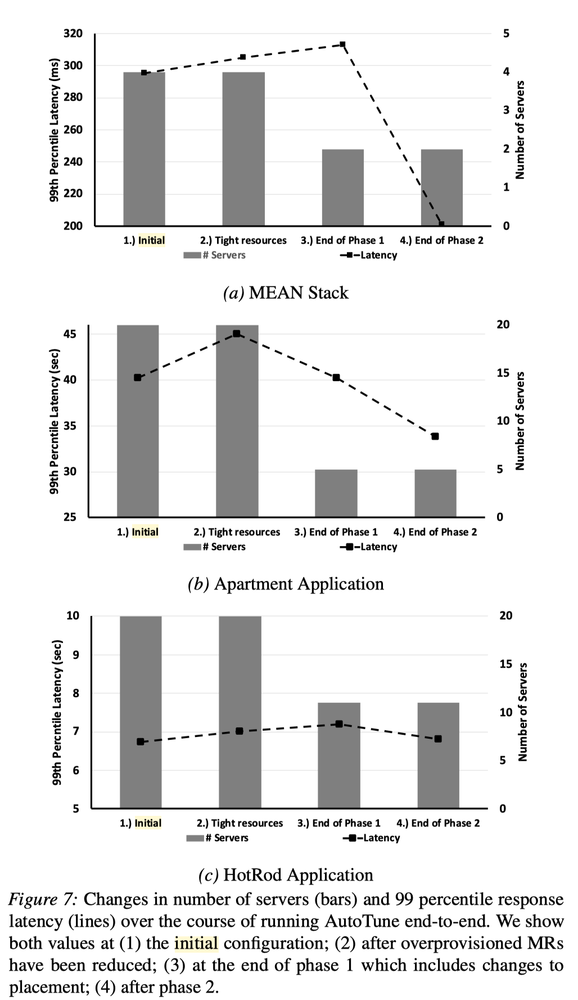

## Introduction

This paper focuses on reducing the resource usage (in terms of the number of sed servers) of microservice application deployment while keeping similar or better performance.

There are three main assumptions:

1. The workload is stable or predictable. AutoTune need stress-test under the same workload for many times
2. There should be a test environment. Achieving high performance on this environment means achieving high performance on the production environment.
3. The operators can provide an initial configuration with acceptable performance, whose performance is used as a baseline.

## Methodology

AutoTune contains two steps:

1. Resource Clampdown. Find the most over-provisioning resources and reduce them. In this step, AutoTune reduce the number of server as much as possible.
2. Performance Improvement. Maximum performance by reallocating resources on the given servers.

#### Resource Clampdown

###### Getting tight resource allocation

For each microservice, AutoTune finds how a resource of it impacts the **overall performance** by stress-test.

At each iteration, AutoTune reduces the resources allocated by stress-test on the non-impact resources. In the end, there are no non-impact resources, i.e., a stress test on any resources causes performance degradation.

###### Reduce the number of servers

AutoTune achieves this by re-place microservice on server.

Given a number of servers, at first, AutoTune tries to re-place each microservice to ensure that each pair of colocated services differ in their most impacted resource.

When this constraint is not feasible, AutoTunes switches to a round-robin strategy.

By testing, if the overall performance degrades, then we increase the number of servers.

#### Performance Improvement

Adjust resource allocation on the microservice located on the same server by gradient descending.

## Evaluation

## Thinking and Conclusion