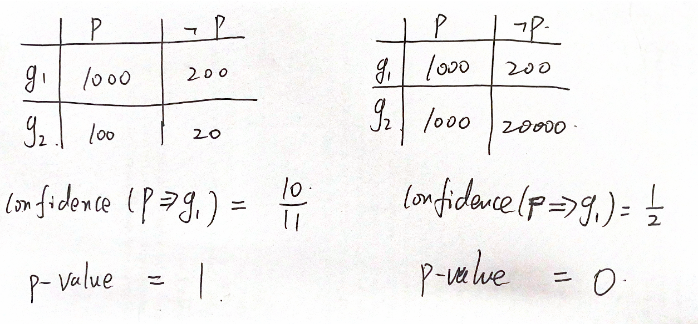

## Introduction

Fixing crashes in time is important. Automated crash reporting systems collects information at the time of crash.

crash reporter

The number of crash reports is huge. Thus, it is not practical to process them on an individual basis. 

Crash reports contain a lot of attributes.

A typical process workflow consists of two steps:

1. crash report clustering
2. cluster featuring and analysis

This paper focuses on step 2: single out the most meaningful features.

Given the distinctive features of crash groups, developers are freed from manual analysis and can focus on fixing crashes.

## Approach

Based on [STUCCO](https://en.wikipedia.org/wiki/Contrast_set_learning##STUCCO) algorithm.

#### Contrast set mining problem

Contrast set: an attribute-value pair whose supports in different groups deviate a lot.

The deviation should be **large** and **significant**.

Large: the supports in at least one pair of groups should be different enough.

Significant: rejecting the hypothesis that the supports in all groups are the same

#### STUCCO

STUCCO performs a breadth-first level-wise search in the tree

###### Selecting Large Contrast-Sets

calculating support and comparing it with the user-defined threshold

###### Selecting Significant Contrast-Sets

performing chisquare test and get a significance level $\alpha$

Example contingency table for p=W

What is challenging here is to determine the cutoff significance level. The challenges are:

1. The cardinality of candidate contrast-set is large, and thus, the overall false alarm rate would be large.
2. Since we perform level-wise search, we do not know the exact number of candidates.

According to the Bonferroni correction, we can control the overall false alarm rate by downscale the threshold:

But we do not know $k_{true}$.

Since Bonferroni correction holds as long as $\sum \alpha_i < \alpha$, so we downscale the threshold level-wise

where $C_l$ is the number of candidates of level $l$  ($\sum_{l}\frac{\alpha}{C_l 2^l}\le \sum_l\frac{\alpha}{2^l}\le \alpha$)

> The min rule ensures that, as we move to deeper levels, the α cutoff can only decrease, making the tests more likely not to reject the null hypothesis.
> 

###### Selecting Surprising Contrast-Sets

The independence of the features in the contrast-set. 

If the support of the specialization can be derived based on an independence conjecture, then the specialization itself does not add information (is not surprising) and thus can be discarded even when it is a deviation according to the definition.

###### Prune the Search Space

> Minimum deviation size. When a contrast-set has support less than δ for every node, it can be pruned. In fact, if the support is smaller than δ for any given group, the difference between any two supports cannot be larger than δ
> 

> Expected cell frequencies. The validity of a test depends on the size of the available sample, becoming scarcely reliable when only a small number of items are available. A typical lower bound for the χ 2 test is 5 [11]. Therefore, when we reach a contrast-set with a number of occurrences smaller than 5, we can safely prune it, since any further specialization can only further reduce the number of occurrences.
> 

> χ 2 bounds. Bay and Pazzani showed that it is possible to define an upper bound on the χ 2 statistic. This can be used to prune nodes, when we know that the corresponding statistic will not exceed the α cutoff.
> 

(*do not know how to use it*)

> Identical support. Specializations with the same support as the parent might be not interesting and can be discarded. They target the same set of dataset entries as the parent and often represent findings that are common knowledge (e.g. the support of {platform_detail = Debian Wheezy} will obviously be the same as the support of {platform = Linux, platform_detail = Debian Wheezy}: the addition of {platform = Linux} provides no information).
> 

> Fixed relations. Often a group has larger support for a given contrast-set than any other group and specializing the contrast-set with additional attribute-value pairs does not change the situation. In those cases, the node can be pruned.
> 

#### Domain-Specific Variations

> Testing candidates for each couple of groups is clearly infeasible. Therefore, in our implementation, we test each group against the rest of the dataset
> 

> When a dependency is found, the percentage of occurrence is recalculated restricting the group to the reports where the dependency holds true
> 

## Evaluation

Over 800 real crash reports in Mozilla.

> For **90 of these reports (41 closed)** we have definitive evidence that our tool was used
> 

## Takeaways

STUCCO is a special form of association rule mining algorithm. It mines contrast set.

Contrast sets are the key predicator to identify different groups, while common association rules are a predicator to a specific group.

Contrast sets are defined by support and significance (by chisquare test), while common association rules are defined by support and confidence.

For example, if there are two groups ($g1$ and $g2$), and the target predicator is $p$.

$tpg1=P(p\land g1),tpg2=P(p\land g2), npg1=P(\neg p\land g1), npg2=P(\neg p \land g2)$

Common association rules ($X=>g1$):

1. $\frac{tpg1}{tpg1+npg1}>\delta_s$
2. $\frac{tpg1}{tpg1+tpg2}>\delta_c$

Note that $npg2$ is not used at all.

For contrast set, it computes the chisquare statistic:

$\chi^2=\frac{(tpg1-tpg1_e)^2}{tp}+\frac{(tpg2-tpg2_e)^2}{tp}+\frac{(npg1-npg1_e)^2}{np}+\frac{(npg2-npg2_e)^2}{np}$

where $tpg1_e=(tpg1+tpg2)*\frac{tpg1+npg1}{tpg1+tpg2+npg1+npg2}, npg1_e=(npg1+npg2)*\frac{tpg1+npg1}{tpg1+tpg2+npg1+npg2}......$

Note that $npg2$ is used.

confidence and significance (chisquare) are different

STUCCO is a level-wise tree search algorithm.

At each level, it scans the candidates for their support and significance.

An important technique here is how to determine the threshold of significance to control the overall false alarm rate.

During the tree search, a series of pruning techniques can be used. Note that useful association rules may be pruned.

Generally speaking, STUCCO is similar to Apriori.