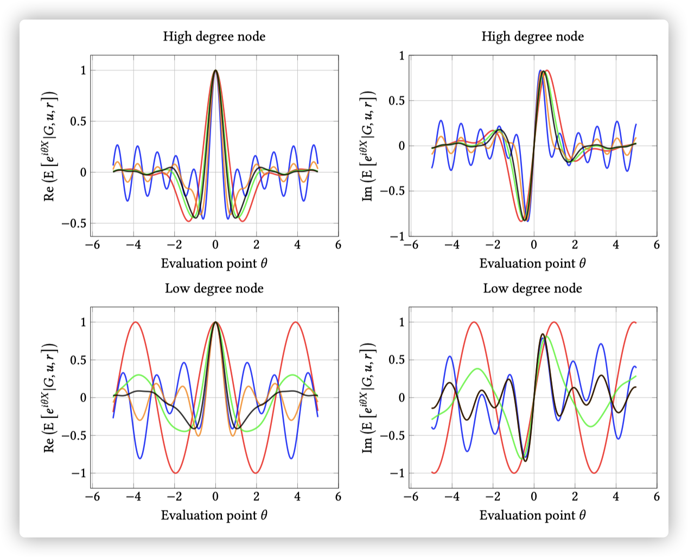

## Introduction

问题：node embedding

node embedding的关键是编码邻域里的节点的feature。例如通过node2vec walk可以收集邻域里有哪些节点，然后直接把这些节点的feature放在一起，或者跑一个word2vec，就是一种embedding。

这篇文章的思路是建模邻域里的节点的feature的分布，并且通过分布的特征函数去描述这个分布。特征函数相当于傅立叶变换，描述原本的邻域feature的分布可能比较复杂，因为可能邻域里节点很多，但是通过其特征函数来描述就会更简单。

图上每一条线是一个特征函数（的实部或者虚部），可以看到high degree和low degree节点的特征函数很不一样

## Methodology

首先定义一个节点$u$的feature的特征函数$\phi_x(\theta)=\mathbb{E}[{e^{i\theta x}}]$

因为特征函数是复函数，我们分别考虑其实部和虚部即可

$P(w|u)$表示了每个邻居的权重，本文通过r-scale随机游走定义这个权重。

$\hat{A}$是归一化的邻接矩阵，所以$\hat{A}^{r}_{u,v}$就表示**正好**经过r步从u到v的概率。本文中最后会使用1→r的每一个得到的embedding再concat起来。

（但是原文这里这样岂不是不包含自身的feature了？同时也处理不了孤立点，可能用$\hat{A+I}$才更加合理）

因为我们不能精确表示一个函数，所以我们必须在$\theta$的定义域上采样一些点，用这些点的特征函数值组成的向量表示特征函数。

为了计算整个图的特征函数向量，可以直接用outer product

因为图上可能不止一个feature，所以最后还需要把多个feature得到的embedding concat起来

所以完整的算法是：

每个节点的embedding的维度是$d * r * k$

walk_length * k

在论文的实验中，在很大的数据集上d=16,r=2，所以最后编码出来的embedding是比较小的。

## Evaluation

通过下游任务的效果进行评测

## Thinking and Conclusion