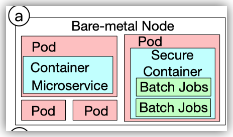

这篇文章基于阿里巴巴的一周的微服务数据 (数据已经开源在GitHub上, [https://github.com/alibaba/clusterdata](https://github.com/alibaba/clusterdata)) 进行了统计分析. 基于统计分析的结果, 这篇文章进一步提出了一个生成过程, 用来生成符合其统计结论的traces.

虽然现在已经有各种各样的microservice benchmark (比如DeathStarBench), 但是这些benchmark的规模过于小,往往只有几个到几十个微服务. 相比之下, 本文所用的阿里巴巴的数据有超过30,000个微服务. 因此本文基于真实场景下的分析更有价值.

阿里巴巴的微服务架构是在bare metal上运行的kubernetes集群.  在每个bare metal上, 会有若干个pod, 每个pod对应一个微服务的一个实例. 一个微服务可能会有很多个实例, 并且这些实例会被分散在许多不同的bare metal上.  数据库服务(后面讲的stateful 服务) 是运行在单独的集群上的. 而对于其他的服务 (stateless服务), 它们所在bare metal上可能会有batch jobs使用的container. 这些batch jobs是离线的批处理任务, 和整个在线微服务系统不同. 这么部署是为了提高集群的资源利用率. 

这篇文章的统计分析从几个方面展开.

首先是trace拓扑的统计. 在本文中, 一个call graph (即一条trace) 是一个user发起的请求在整个微服务系统上引起的各种调用的总和, 包括它们之间的触发关系 causal dependency. 用户直接调用的那个微服务叫做 entering microservice. 在每一对微服务中, 调用方叫做upstream microservice (UM), 服务方叫做downstream microservice (DM). 注意这里的upstream和downstream指的是调用关系,而不是依赖关系的上下游. 

这篇文章中, 微服务首先被分为两类, stateful 和 stateless. Stateful微服务指的是那些存储数据的微服务, 比如database和 memcached. Stateless 微服务就是那些只提供服务, 不存储数据的业务服务. 本文对这两类服务的观察有以下几点.

1.  stateful只提供简单的读写接口, stateless服务会提供几十上百的复杂的接口
2. stateful服务一般不会有下游调用, 而stateless服务则不一定.

微服务之间的调用关系也被分为三类. 包括inter-process communication (IP), remote procedure call (RPC) 和 message queue (MQ). *一般来说, RPC应该是一种特殊的IP实现而已*. 但是在本文中, IP特指 stateless 调用 stateful 的关系.  而RPC和MQ发生在stateless服务之间. RPC是双向的, DM需要给UM一个返回值. 而MQ是单向的, UM将请求放到MQ之后对UM而言就结束了, 怎么处理就是DM的事, DM也不需要有返回值.

一条trace中包含的调用数量是heavy-tail分布,即数量特别大的trace比例相对比较大. 一个有趣的观察是在大的trace中, memcached的比例提高了20%以上.

相比之下, trace的深度大部分都很浅, 超过60%都不超过3. 但是也有极少数特别深的(20). *本文据此说现有的用深度模型建模trace的方法都容易过拟合, 但并不令人信服*

Trace一般表现出树的形式. 在每一条trace中, 一个微服务一般只被一个UM调用. 一个微服务可能调用0-许多个微服务. 但是也有长链的形式.

存在少量的微服务是热点服务, 绝大多数的trace都会调用它们. 

同一个服务可能存在很多中不同的trace结构. 这里的trace结构是通过InfoGraph算法进行embedding, 然后使用k-means聚类得到的.

对于stateless服务而言, 有的服务永远不会有DM, 而有的服务总是会有DM. 它们分别被称为blackhole和relay. 随着层数的增加, blackhole出现的概率增加, 而relay出现的概率减少.

另外, 随着层数的增加 (超过3以后), 调用memcached的边逐渐减少. 这是因为在越深的层cache miss的几率越大. 相应地, 此时调用database的边逐渐增加. 但是增加的服务并没有memcached减少得那么多. 这可能是因为调用MQ的也在增加. 因为MQ是异步的调用, 在很深的trace中使用MQ能降低整体的响应时间 (因为用户感知到的响应时间在调用MQ这里就被截断了, 再深层的时间就和用户无关了). 

然后是对于stateless microservice的具体分析.

首先是stateless microservice之间的循环依赖关系, 这占不小的比例. 这种设计模式*有可能*导致实现微服务的时候导致死循环.

然后是对服务之间强依赖关系的分析. 有17%的服务对之间存在强依赖关系, 即其中一个很可能会触发另一个.

相比之下, 并行依赖 (即两个服务很可能被同时并行调用) 的服务对比例很低.

最后是对response time (RT) 的分析. 

首先, 基于对RT和机器指标的相关性的分析, 这篇文章发现 CPU 和young GC指标相关性很明显, 但是memory相关指标相关性不明显. *但是这似乎并没有什么insights, memory依然是需要关注的指标. 这篇文章后面也分析了, memory增加到一定程度, RT就会收到影响.*

然后, 这篇文章分析了不同的拓扑结构对RT的影响. 具体来说是分析聚类得到的每个类内的RT的STD和类间的STD. 有区别, 但是没有那么显著.

最后这个文章统计了在不同的CPU, memory和调用次数小的RT的统计指标(p-75), 发现CPU的影响基本是线性增加, memory在超过一定值之后会产生明显影响, 调用次数(在保证机器资源正常的情况下)几乎没有影响.

*后面用统计方法生成traces和验证的过程我觉得不存在什么实际价值.*