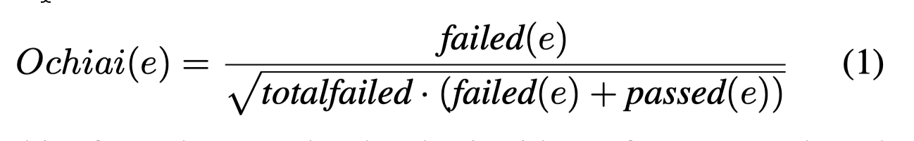
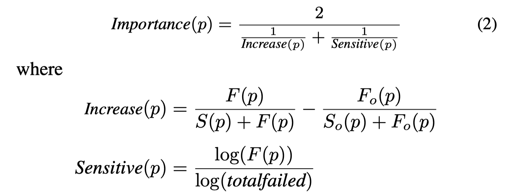

## Introduction

Two popular families of fault localization debugging techniques are 1) spectrum-based fault localization (SBFL) and 2) statistical debugging (SD)

This paper presents a systematical empirical study on the combination of SBFL and SD. The study leads to four findings:

1. most of the effectiveness of the combined approach contributed by a simple type of predicates: branch conditions
2. the risk evaluation formulas of SBFL significantly outperform that of SD
3. fine-grained data collection significantly outperforms coarse-grained data collection with a little extra execution overhead
4. a linear combination of SBFL and SD predicates outperforms both individual approaches

The empirical study focuses on four variation points:

1. predicates (for SD)
2. risk evaluation formula (for SBFL)
3. granularity of data collection
4. methods for combining suspicious scores

The study data is a collection of real-world faults over Defects4J, which are widely used in many recent studies.

Based on the empirical study, this paper proposes a novel fault localization method, PREDFL (Predicate-based Fault Localization).

Experimental results show that PREDFL outperforms previous approaches by 20.8% w.r.t. top-1 accuracy. 

## SBFL and SD

#### SBFL

A typical SBFL collects coverage information for each program element while running test cases, and employs a predefined risk evaluation formula to compute suspicious scores for program elements.

Simple SBFL approaches assign suspicious scores for each program element (the granularity of elements are defined on demand, such as statements or methods).

Recent approaches also considering collecting information at a granularity finer than the granularity of the target elements.

A example risk evaluation formula 

#### SD

Given a faulty program, SD dynamically instruments the program with a set of predefined predicates. Then the program is deployed for execution, and the values of the predicates are collected. Based on the information collected from many executions, SD identifies the important predicates that are related to the root cause of the failure.

Similar to SBFL, SD uses a predefined formula to determine the suspicious score of a predicate, a.k.a. importance function.

A standard importance function

A typical SD uses three groups of predefined predicates:

1. branches
2. returns
3. scalar-pairs

To model the seeding of predicates, seed functions is defined. A seeding function $s$ maps a program element to a set of predicate instances.

## A Unified Model for SBFL and SD

core idea: treat SBFL as a kind of predicate in SD.

Given a instance of predicate $True$ at element $e$, $True^e$, we define its runtime information as follows:

$F(True^e ) = F_0 (True^e ) = failed(e) \\ S(True^e ) = S_0 (True^e ) = passed(e)$

In order to use the SBFL formulas for SD predicates, we define the following:

$failed(p)=F(p)\\passed(p)=S(p)$

Since SBFL give a list of suspicious program elements while SD gives a list of suspicious predicates, a combination method $c$ is defined as $c(s, r, e)$, which take a seed function $s$ , a risk evaluation formula $r$ and a program element $e$ and produces the suspicious score for the element.

Finally, a unified approach is defined as 

$UNI^{s,r,g,c}(E)=\{(e, \max_{e^i\in g(e)}c(s, r, e^i))|e \in E\}$

where $g$ is the granularity function.

## Empirical Study

#### RQ

1. Which kinds of predicates are most important?
2. How does the risk evaluation formula impact the effectiveness of fault localization?
3. How does the granularity of data collection impact the fault localization result?
4. How does combining method among different predicates impact the effectiveness of fault localization?

#### Study Data

Defects4J

#### Metrics

top-k recall

EXAM score. It sound like a relative MFR (mean first rank).

> the percentage of program elements that need to be inspected by developers among all candidates before reaching the first desired faulty element, reflecting the relative ranks of faulty elements among all candidates and the overall effectiveness of a fault localization approach
> 

#### Results

## PREDFL

> Therefore, we propose a new fault localization approach via instantiating the unified model with all default configurations, i.e., collecting all groups of predicates at statement level and linearly combining predicate scores computed with Ochiai formula. For convenient reference, we call this approach as PREDFL.
> 

## Thinking and Conclusion

If wee treat traces as test cases and microservices (or APIs and spans) as program elements, then how to instrument predicates to apply PREDFL?

Instrumentation is hard, but if we take coarse-grained elements such as microservice as our target, then we should consider the most fine-grained elements.