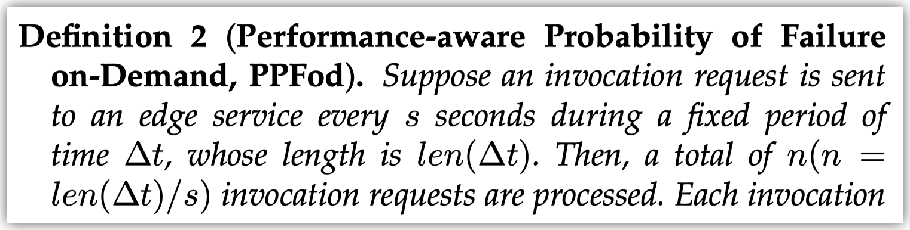
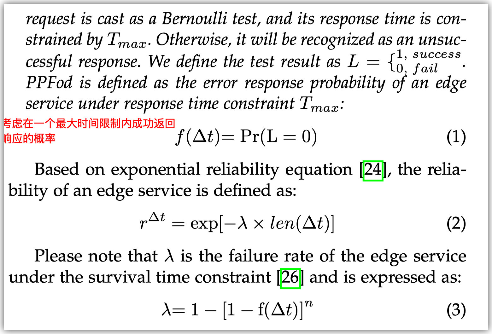
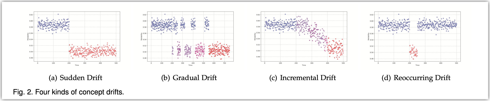

这篇文章聚焦于MEC场景下边缘计算设备的异常检测. 由于边缘计算场景的特殊性, 边缘计算设备的指标会有经常性的concept drift, 因此如何对这样的指标进行异常检测是有挑战的. 这篇文章提出了一个基于concept drift的异常检测方法. 另外基于此又提出了一个对边缘计算设备的调整方法用于mitigation.

这篇文章检测的指标是reliability, 定义方法如果所示

这个指标反映了一个系统在给定时间内能成功返回结果的概率.

这篇文章总结了四类concept drift, 检测的目标就是这样的concept drift

这篇文章的检测方法分成四步

1. 收集数据
2. 对历史数据做采样. 这里采用滑动窗口, reliability曲线上的每一个窗口是一个sample. 采样的目标是保留w个窗口. 具体方法是对$1\to t$的时间戳, 第i个时间戳以$w/i$的概率替换已有的随机(uniformly)位置的窗口.
    1. 当前数据也是使用w个窗口
3. 对当前数据($X_n =(x_{ij})_{\omega \times \gamma}$ )和历史数据 ($X_h$)计算FDC (Fractional Distribution Change). 具体方法就是计算$X_n$和$X_h$的SVD分解得到的singular vectors的JS散度.
4. 对FDC序列使用固定阈值进行异常检测.

*这篇文章一开始还以为是基于经常发生concept drift的背景下对UTS进行异常检测, 但是实际上它去检测的就是concept drift (即UTS的分布和历史数据发生显著变化), 实际上没什么特别的.*