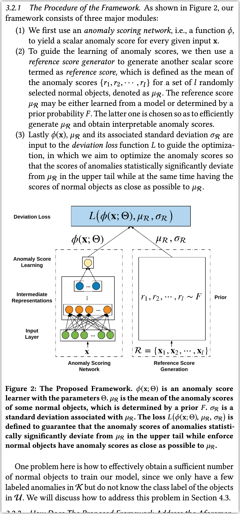

现有的DL-based异常检测方法主要的模式是学习数据的表示, 然后再采用某种传统的异常检测方法. 但是这样的方法会导致学习到的表示可能对于采用的特定异常检测方法不是最优的. 尽管也有一些工作尝试在学习表示时考虑异常分数, 但是学习的核心还是表示.

这篇文章尝试直接端到端地去给出一个样本的异常分数. 通过数据中的少量label, 这篇文章设计的deviation loss会迫使异常样本的异常分布和大部分样本(被认为是正常样本)的异常分数有明显的偏离. 这个模型被叫做DevNet

DevNet需要使用的label数目是很少的.

> DevNet leverages multiple to dozens of labeled anomalies, accounting for only 0.005%-1% of all training data objects and 0.08%-6% of all anomalies per data set
> 

这个文章的思路如下图所示

首先, 对于每个样本, DevNet通过一个DNN输出一个异常分数$\phi$

然后, DevNet计算l个正常样本的异常分数的均值 ($\mu_R$) 和标准差 ($\sigma_R$), 被称为参考分数.

最后, deviation loss会使得异常样本的分数和参考分数尽量远离, 正常样本的分数和参考分数尽量接近.

也就是说, 

$$
dev(x)=\frac{\phi(x)-\mu_R}{\sigma_R}\\
\mathcal{L}=\sum_{x}(1-y)|dev(x)|+y\max(0, a-dev(x))
$$

DevNet的这个思路很好, 就是想办法把异常样本的anomaly score从正常样本的anomaly score中isolate出来. 但是存在两个重要的问题:

1. 首先如何得到l个正常样本. DevNet的实现中并没有真的去采样正常样本并计算分数, 而是直接给出了一个正常样本的异常分数的先验分布 ($\mathcal{N}(0, 1)$), 然后直接从这里面采样异常分数. 但是此时$\mu_R$和$\sigma_R$其实相当于都固定成了0和1
2. 另一方面, loss中需要知道样本的标签. 但是实际上数据集中只有少部分的异常标注和大量的无标注数据, DevNet采取的方法是把无标注数据的标签都当成0.

本质上DevNet还是会异常和正常的二分类, deviation分数只是对模型输出的一个线性变换而已. loss函数和binary cross entropy也很相似. 

那么为什么DevNet能够只用很少一部分label就对很多没见过的异常样本进行分类?

我理解可能是因为DevNet的loss函数更类似一个one class分类问题, 它更主要关注正常的样本应该是0, 异常的样本其实只要大于a就行. 为了避免模型回退到给所有的样本输出0, 才需要一部分异常label.