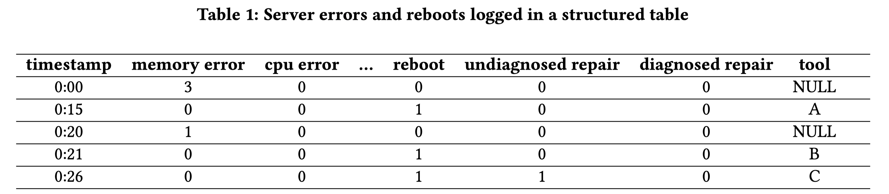

## Introduction

**Problem**: root cause localization based on structured logs in large-scale service, i.e., mining association rules from structured logs for automated root cause analysis. 

**Input:**

A example structured log

**Output:**

{ kernel version 4.15, service B} ⇒ exception

{ service type A, build version 0.2.1} ⇒ failure

The problem is similar to multi-dimensional root cause localization.

Supervised machine learnings methods such as LR are often not interpretable and require manual feature engineering.

STUCCO, a tree-based algorithm, may prune important association rules because a tree-based algorithm would prune a whole subtree each time rather than prune one node.

This paper uses traditional frequent pattern mining techniques (i.e. Apriori and FP-growth).

This paper proposes a series of preprocessing and filtering techniques to improve the scalability.

## Methodology

#### User-Specified Filters

The framework allows users to specify columns to be excluded in the dataset

#### Variability-Based Filters

Columns that are unique identifiers about the entities need to be excluded, such as timestamp and span ID.

The framework automatically checks to exclude columns with the number of distinct values > D portion of the number of samples. 

Empirically, we use D = 2% in one of our applications, and the proper setting of D highly depends on the nature of the dataset

#### Query and Dedup (Scuba)

Scuba is a in-memory database.

Utilizing Scuba’s scalable infrastructure [1], this framework query pre-aggregated data which are already grouped by the distinct combinations of column values, with an additional weight column that records the count of the identical entities.

This pre-aggregation significantly reduces the amount of data that we need to process in memory and would reduce the runtime of our production analyses by > 100X.

For example, here is the original structured logs:

{service type=A, version=0.1, failure=True}

{service type=A, version=0.1, failure=True}

{service type=A, version=0.1, failure=True}

{service type=A, version=0.2, failure=True}

{service type=B, version=0.1, failure=True}

By pre-aggregated, they are grouped as:

{service type=A, version=0.1, failure=True, weight=3}

{service type=A, version=0.2, failure=True, weight=1}

{service type=B, version=0.1, failure=True, weight=1}

#### One-Hot Encoding and Frequent Pattern Mining

Just applying the algorithm (Apriori / parallel Apriori / FP-Growth) on the fetched data from Scuba.

There are two thresholds:

min-support: the minimum support of the mined frequent itemsets

max-length: the maximum length of the mined itemsets

Support is defined as $P(X|Y)$, where X is the itemset and Y is our target of interest (e.g. a failure).

#### Filtering with lift

There are a lot of interestingness measurement for a itemset.

Confidence ($P(Y|X)$) is widely used. However, the threshold of confidence is closely dependent on the nature of the dataset.

> For example, suppose that we have 100 failures and 1 million reference samples. If feature X exists for 100% of failures Y but 1% of references, intuitively X should be a good predictor for Y; however confidence will be small (< 0.01) due to the large number of reference samples with feature X
> 

*So when using confidence as the interestingness measurement, it would be better to avoid threshold selection.*

To solve the problem, this paper proposes to use lift ($\frac{P(XY)}{P(X)P(Y)}=\frac{confidence(X=>Y)}{support(Y)}$)

The intuition of lift is to measure the independence between X and Y (lower lift, larger independence).

Note that since Y is a constant in our problem, lift is actually a linearly scaled confidence.

#### Filtering for interpretability

Motivation: there can be multiple findings describing the same group of samples

So this framework proposes two filtering rules:

$H_*$ are user-specified parameters.

## Evaluation

#### Subject

Two real-world fault from Facebook (named ASE and SR). Not published.

ASE: 20 features, 1500 distinct feature values, tens of thousands distinct itemsets (i.e. distinct leaf attribute combinations)

SR: 50 features, 500 distinct feature values, 7000 of thousands distinct itemsets (i.e. distinct leaf attribute combinations)

*The number of distinct itemsets is not that large.*

#### The scalability improvement of pre-aggregation

#### The scalability improvement of other filtering techniques

Not evaluated

#### The interpretability improvement

The triangle marker means the actionable association rule.

A readable com

#### Comparison with previous approaches

Not evaluated

#### Other findings

###### The relationship between the number of reported frequent item-sets and min-support and max-length

###### The relationship between running time and ##itemsets

###### Lessons learned

> In a real-time analysis or debug, a lower max-length can be set to reduce runtime, and a higher min-support can be applied to report only the most dominant issues in the dataset.
> 

> In a more thorough analysis that is less time-sensitive, a higher max-length can be applied to generate a set of rules that are overall more descriptive,
> 

> If there exists a clear convergence point given different max lengths, a lower max-length should be used to avoid unnecessary computation
> 

> If the RCA application is very sensitive to runtime and the number of item-sets is small, one could first run the analysis similar to the one presented in Figure 4 and use multi-threaded Apriori in the region where it outperforms FP-Growth
> 

*All of there are less insightful*

## Thinking and Conclusion

What is the different of the scalability with or without the optimizations?