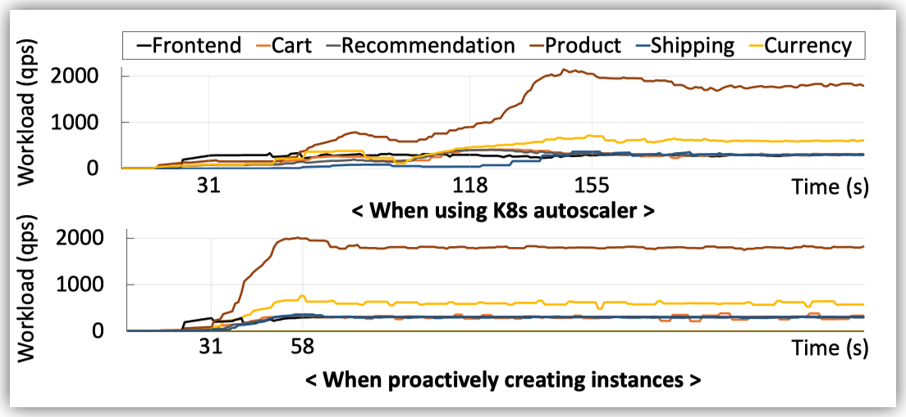

GRAF的目标是对microservice系统进行资源管理, 以在最小化资源使用的情况下满足SLO.

这篇文章中的资源只包括CPU, SLO只包括end-to-end tail latency.

GRAF的motivation包括两点, 首先是应该同时对所有的microservice进行资源调整, 其次是需要针对microservice之间的关系进行分析而不是对每一个microservice单独分析.

第一点原因是cascading effect. 由于进行scaling操作是需要一段时间的, 所以下游的微服务会首先出现资源不足的情况, 然后会进行scaling. 当下游服务scaling完成后, 它所处理的请求就会增加, 此时发送给上游服务的请求才会增加, 然后上游服务出现资源不足. 因此cascading effect会导致整体的scaling时间变长, end-to-end latency提高.

第二点是由于microserivce不同的性质和microservice之间的关系. 比如, 如果一个服务的latency对资源更加敏感, 那么它就需要更多的资源. 另外, 对于处于非关键路径上的微服务, 减少这些微服务的latency并不能影响end-to-end latency.

GARF的问题可以形式化为下面的最优化问题.

$$
\min_{\vec{r}}\sum_{r\in\vec{R}}r\\
s.t.\>L(\vec{r}, \vec{w})\le \text{Latency SLO}
$$

其中$\vec{r}$表示所有微服务的资源, $\vec{w}$表示所有微服务的workload. $L(\vec{r}, \vec{w})$表示在对应的资源和workload状态下的end-to-end latency.

第一个问题是怎么计算$L(\vec{r}, \vec{w})$. GRAF通过有监督的方法训练了一个regressor. 具体的模型采用了GNN.

这一步的loss设计有三点改进(基于MSE).

首先, 为了提高稳定性, 对于极端值的loss需要减少. 所以GRAF对于一个范围内的latency采用MSE, 超过这个范围的极端值用线性loss.

其次是采用相对误差, 避免模型对于小的latency值预测效果差.

最后是采用非对称的loss, 因为这里我们可以接受少量的overestimate, 但是不能接受underestimate.

$$
Loss(x)=\begin{cases}
-\theta_L (2x + \theta_L)& x < -\theta_L\\
x^2 & \theta_L \le x \le \theta_R \\
\theta_R (2x + \theta_R) & x > \theta_R
\end{cases}
$$

第二个问题是怎么解这个minimization问题. GRAF把约束项转化为一个惩罚项, 然后通过梯度下降去解.

$$
\min_{\vec{r}}\sum_{r\in\vec{r}}r+\rho\times \phi(L(\vec{r}, \vec{w}), SLO)\\
\phi(a, b) = \max(0, a - b)
$$

在计算出最佳的$\vec{r}$之后, GRAF会对所有的microservice进行scaling in/out