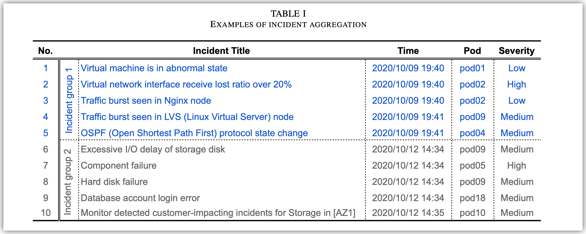
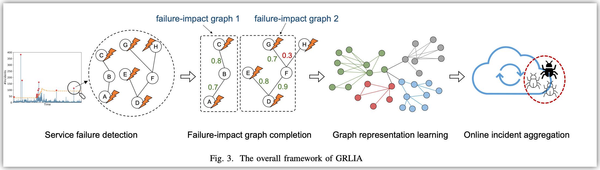

这篇文章处理的是incident aggregation (告警聚合)的问题: 当故障发生时, 由于在线服务系统的复杂结构和庞大的规模, 监控系统会触发许多incidents. 为了让运维人员避免逐个检查这些incidents, 我们需要把属于同一个failure的incidents聚合在一起.

现有的工作许多都采用了告警的文本特征作为判断告警是否属于同一类的依据, 但是实际上同一个故障触发的告警可能有很不同的文本描述. 因此这篇文章希望用告警的时序和拓扑关联关系来做聚合.

这篇文章的方法, GRLIA (graph representation learning-based incident aggregation), 包含四个部分.

首先需要基于告警判断什么时候发生了故障(failure). 因为实际上会一直存在背景告警. 现有常用的方法是设置一个简单的阈值, 但是不够灵活. GRLIA采用了EVT方法来对incident数量的时序曲线进行检测, 来判断哪一分钟发生了故障. 连续的故障时间将被视为同一个故障.

在这一步中, recall比precision更重要, 因为后续的incident关联分析受误报的影响小.

第二步是分析每个故障影响的范围,所谓failure-impact graph. 这里的graph中的vertex是服务. 这么做的原因有两点

1. 有些告警是背景告警, 和我们关心的故障没有关系
2. 同一时刻可能发生着多个故障

这篇文章采用Louvain, 一个知名的community detection算法来计算failure-impact graph. 这个算法依赖我们定义图上边的权重. GRLIA采用两个权重的加权平均来计算.

1. 首先是两个节点的指标的相似度. 指标是工程师人工选择的, 相似度计算采用DTW. 这一步是为了处理有些服务没有能准确报出告警,或者告警被各种规则忽略了等问题, 导致同一个故障中的告警服务在图上连通不起来的问题.
2. 其次是两个服务的告警集合的相似度. 这里的计算采用了Jaccard Index. *但是不太清楚怎么定义两个incident相等的,是incident类型相同么?*

第三步是将一个incident转换成向量表示, 以用于后续的相似度计算. 这里的向量表示中包含了incident的拓扑信息.

具体来说, 这里采用的DeepWalk方法, 但是不太清楚是怎么输入一个incident的, *应该是采用已知的incident类型字典进行编码?*

最后一步是进行相似告警的分析, 这里采用了两两计算相似度的方法. 相似度是两个数字的平均. 一个是incident的向量表示的cosine similarity, 一个基于是两个告警所处服务在图上的最短距离. *不是很理解为什么需要加第二个, 因为向量表示中本身已经包含了拓扑信息了.*

这篇文章的evaluation是基于华为的私有系统和私有数据的, 相似告警是工程师人工标注的, 大约标了500个左右故障, 10w个左右incident. *感觉靠人工标这么多实在开销很大, 标注平台应该有一些专家规则可以用来减少标注开销.*

为了证明EVT检测故障的有效性, 和thresholding方法进行了对比. 这个问题应该挺简单的, thresholding的效果已经不差了.

为了评测告警聚合的效果, 和几个SOTA baseline进行了对比. GRLIA的互信息都是最高的.

最后对比了GRLIA和去掉第二步的效果.