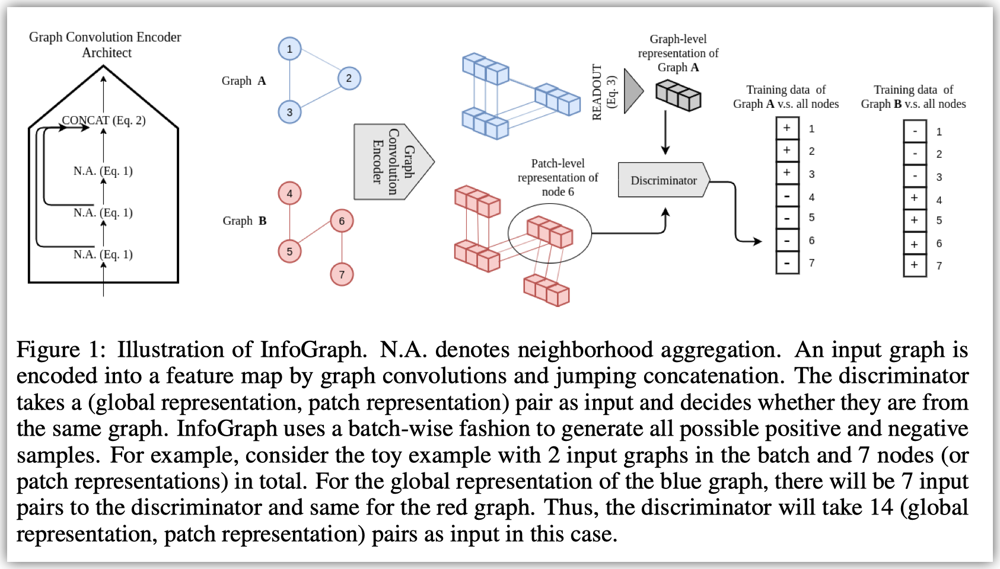
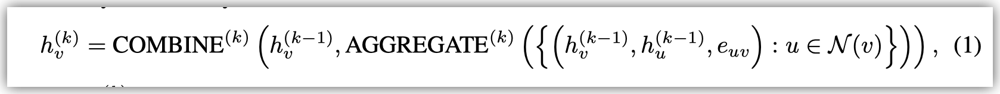
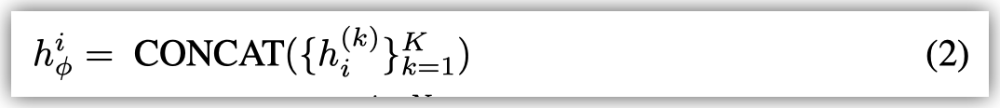
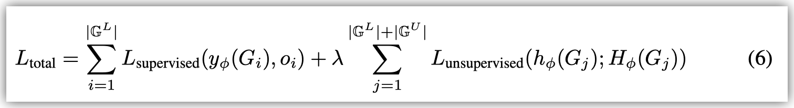
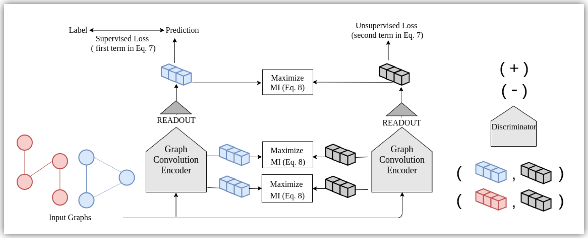

这篇文章聚焦于用无监督或者半监督的方法学习graph embedding. 这里有两个关键点, 首先InfoGraph学习的是全图的embedding而不是node embedding. 其次这篇文章立足于无监督方法. 全图的embedding 学习实践中可能有很多用处, 比如用来表示分子结构, 或者调用链. 

作者代码: https://github.com/fanyun-sun/InfoGraph

DGL复现: https://github.com/hengruizhang98/InfoGraph

一个基本的encoder的结构包括若干层的AGGREGATE+COMBINE和一层CONCAT.

输入的feature是每个节点的node feature.

对每一层而言, 可以表示成如下形式：$h_v^{(k-1)}\to h_v^{(k)}$,从第k-1层的feature得到第k层的feature

具体来说这篇文章采用了GIN: $\mathbf{x}^{\prime}_i = h_{\mathbf{\Theta}} \left( (1 + \epsilon) \cdot\mathbf{x}_i + \sum_{j \in \mathcal{N}(i)} \mathbf{x}_j \right)$

> We use GIN Xu et al. (2018a) while DGI uses GCN Kipf & Welling (2016) as GIN provides a better inductive bias for graph level applications
> 

最后一层concat是为了考虑不同尺度的聚合结果.

最后从单点的feature到全图的feature (a.k.a., READOUT), 这篇文章采用了SUM

> For example, we use sum over mean for READOUT and that can provide important information regarding the size of the graph.
> 

在训练时, InfoGraph考虑最大化每一个mini-batch内的互信息.

对于每一个graph feature和node feature, InfoGraph希望这个distriminator($T_{\phi, \psi}$)能够区分两者是不是属于同一个图.

进一步地, 这篇文章扩展到semi-supervised场景.

直接在训练上述encoder的时候加上supervised loss (如下图), **可能**会导致negative transfer的问题 (*按我理解这里只是存在这样的可能, 具体会不会也没有很强的说理或者实验证据*)

> However, supervised tasks and unsupervised tasks may favor different information or a different semantic space. Simply combining the two loss functions using the same encoder may lead to “negative transfer”
> 

因此这篇文章提出下如下的框架

此时InfoGraph* 同时训练两个相同结构的encoder.

左边的encoder通过label去直接有监督地训练, 右边的encoder通过无监督的方式去训练.

为了将无监督学习到的特征表示转移到有监督的encoder, 在训练时会最大化两个encoder学到的表示的互信息. 特别地, 这里不仅仅是最终的表示, 而是每一层的表示.