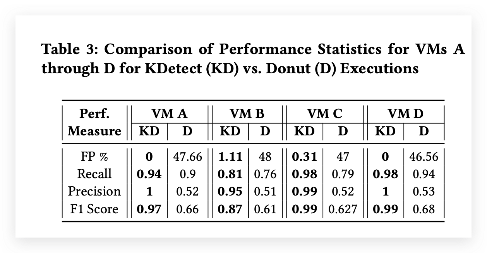

用聚类方法对KPI（滑动窗口）做无监督异常检测

基本的方法是用SBD对滑动窗口进行聚类，然后再确定每个类是正常类还是异常类

这里有两个问题：

1. 如何确定类别个数
2. 如何确定类是不是正常的

KDetect使用density解决这两个问题，density指的是类内点的密集程度。

k通过density-k曲线的local optimum 得到

在第一次聚类（k=2）的时候，较大的那个类是初始的正常类，将该类的密度的2倍作为密度阈值，到初始正常类的距离超过阈值的就是异常类。Intuition就是正常的曲线（滑动窗口）都应该在初始正常类内或者附近。

数据标注是由自己的experts手动完成的。
