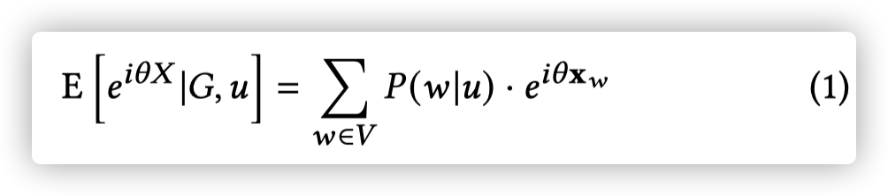
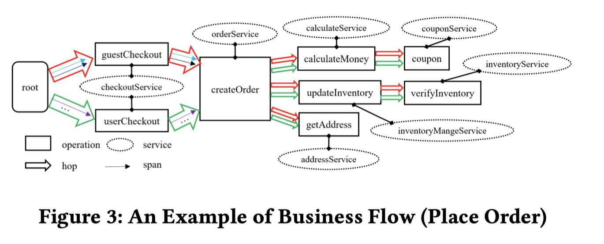
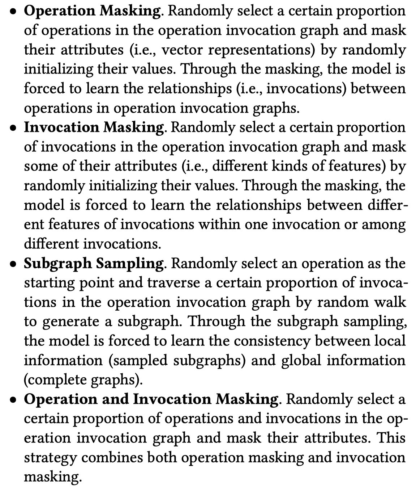
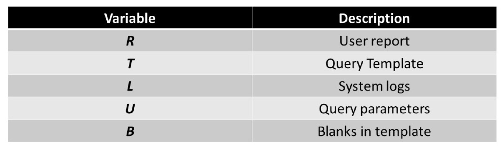
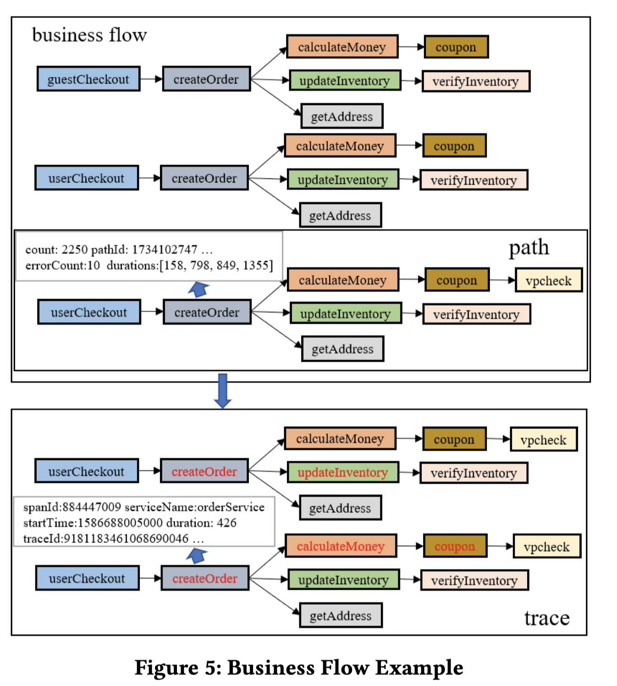

Conference/Journal: KDD
Created: July 10, 2020 3:26 PM
Created by: Zeyan Li
Rank: A
Short Name: MultiImport
Tags: Node Importance
Type: Research Paper
Year: 2020

## Introduction

KG上的节点重要性排序问题是个重要的问题。

这个问题的一个关键挑战在于如何综合不同的数据源。

现有的方法，最经典的PageRank只利用了图结构本身的信息，personalized PageRank可以考虑一个input signal。现在的SOTA是GENI(同一个组去年在KDD2019的文章)，通过有监督框架取得的。不过这里的监督信息就是signal本身啦

但是这些方法都只能考虑至多一种input signal。

## Methodology

###### Perliminary

GNN

Knowledge Graph (KG)，$\mathbf{G}\in \mathbb{R}^{||V||\times ||P|| \times ||V||}$，每个元素$(s, p, o)$代表节点s和o通过谓词p连接。两个节点之间可以存在多个谓词

Node Feature，每个节点有**固定长度**的向量，表示这个节点的信息。$\mathbf{X}\in \mathbb{R}^{||V||\times F}$

Input Signal. $S: V' \to \mathbb{R}_{\ge 0}, V'\sube V$

使用latent model，认为有一个latent variable控制着node importance，并且观察到的input signal也是由它生成的。为什么不直接把input signal当成node feature？因为input signal一般是非常稀疏的，填补缺失值是困难的。

###### Learning Objective

这个方法叫 factorization-based KG embeddings

（这里讲了一大堆最后还是用了softmax？）

比起GENI来说，一个显著的不同是考虑了$p(\mathcal{G}|\mathcal{\theta})$

[Estimating Node Importance in Knowledge Graphs Using Graph Neural Networks](./Estimating%20Node%20Importance%20in%20Knowledge%20Graphs%20Using%20Graph%20Neural%20Networks.md)

###### Rebel Signals

就是对排序没什么帮助，有副作用的signal

所以这里的做法是先给Signal聚类，每个类单独训练，最后选一个类的结果

因为直接用signal计算相似度是不行的，需要用生成的importance计算，所以需要一边训练一边聚类，不能直接聚类。

## Evaluation

## Thinking and Conclusion