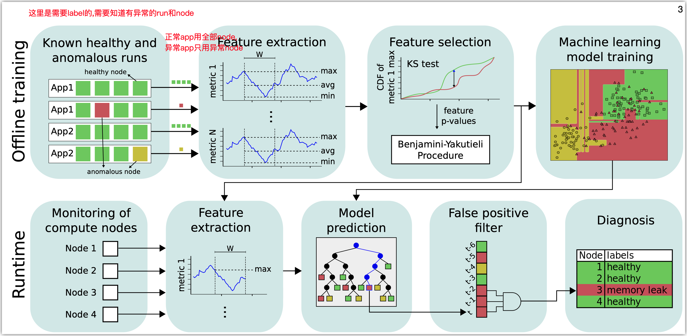

HPC系统中的异常检测和定位是一个重要的问题, 人工定位存在时间开销大和容易出错的问题.

现有的诊断方法中, 基于规则方法的需要大量的人工参与, 并且难以泛化到不同的系统上.

基于时间序列的异常检测方法无法诊断故障, 并且可能需要比较大的计算开销.

最近的机器学习方法往往采用了无监督的模式, 虽然能取得比较好的异常检测性能, 但是没法诊断故障.

这篇文章提出了一个基于HPC中每个节点的指标的有监督机器学习方法, 检测每个节点是否发生了异常以及异常的类型 (即异常原因类型).

> Our goal is to quickly and accurately detect whether a compute node is anomalous (i.e., experiencing anomalous behavior) and classify the type of the anomaly (e.g., network contention) at runtime, independent of the application that is running on the compute node.
> 

特别地, 这篇文章的场景是基于运行批处理任务的HPC系统.

这篇文章的方法如下图所示

在训练阶段, 首先需要收集训练数据.

每一个run对应一个任务, 一个run跑在许多个node上. 本文的检测和诊断的对象就是node.

对于正常的run (这里的正常还是异常是label), 取所有node的数据用于训练. 对于异常的run, 只取根因node的数据用来训练, 因为其他的node受到的影响不好确定.

然后对于每个node的指标, 要进行feature extraction和feature selection.

Feature extraction只提取了一些常见的统计指标, 包括极值, 平均值, 分位数, 矩等等. 这里的提取是基于metric的滑动窗口的.

然后用KS-test和BY过程选择feature. 首先对于每一个feature, 比较它们在异常时候和正常时候(同一个application)的分布的不同, KS-test会给出一个p-value. 得到所有的feature的p-value之后, BY 过程会给出一个阈值, 基于这个阈值得到useful features.

把每个application得到的useful features并起来就是全部的useful features.

最后基于这些feature和异常类型的label, 训练一个多分类模型. 采用的模型包括decision tree/ random forest / AdaBoost.

在检测阶段, 模型给出输出之后, 为了减少误报率, 会要求只有连续C个窗口都被判断为异常才告警.

这篇文章的评估, 是在一个超算了跑了很多不同的application, 其中的异常是通过故障注入得到的. 故障注入的类型也是常见的cpu, memory和network等.

这篇文章的评估说明了以下一些问题.

1. 窗口大小的选择. 对大部分分类器和异常类型来说 , 窗口越小准确率越低. 但是显然窗口越小检测的延迟也越低.
2. Feature selection的效果. 只保留useful feature相比用全部的feature, 可以显著降低FPR和提高recall
3. C的效果. 随着C的增加, 误报率显著下降, 而recall并没有明显降低.
4. Overall performance. 基于上面选择的参数, 本文的方法在异常检测和诊断方面都超过了baseline.
5. 鲁棒性. 讨论了在训练集中去掉一些application的配置方案的run, 去掉application, 去掉异常注入方法, 改变异常注入程度的效果. 
6. 延迟. delay大约是需要几十秒的量级, 但是基本上都比baseline低.
7. Overhead. 计算开销是很低的.