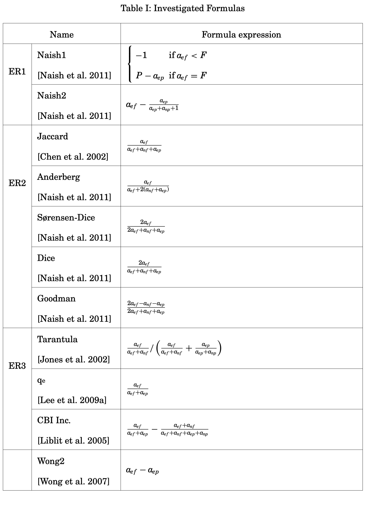

[MicroRCA Root Cause Localization of Performance Issues in Microservices](./MicroRCA%20Root%20Cause%20Localization%20of%20Performance%20Issues%20in%20Microservices.md)

基于MicroRCA，进一步定位S上异常的指标具体是哪个（还是只用了latency来做故障定位）

核心做法是训练一个AE，学习指标的正常模式。认为对reconstrtuction error贡献越大的指标越异常

同时这个AE还被用来辅助上一步的故障系统定位，但是没有看明白具体怎么做

> We observe that applying autoencoder on the service relevant metrics can significantly improve the accuracy of culprit service localization by ranking the faulty service within the top two. Table 2 shows the overall performance of the above two methods for all anomaly cases. It shows that complementing culprit service localization with autoencoder can achieve a precision of 92%, which outperforms 61.4% than the results of CSL only.
>