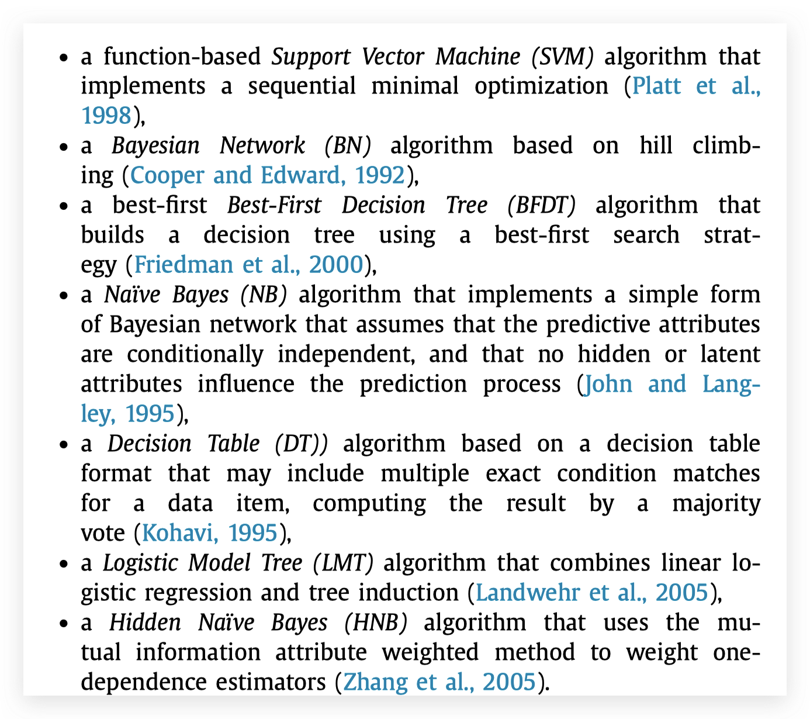

## Introduction

fault和failure：fault是指底层的故障，failure是指整个系统层面的失效。fault先发生，然后慢慢导致failure。

这片文章聚焦于提前预测failure的产生，并且同时预测failure的类型和根因。

预测faillure使用了无监督和有监督方法结合的方法，在异常检测部分，使用无监督的方法检测异常（异常和failure没有必然关系）；在failure预测部分，使用过去的failure数据预测新的failure

## Methodology

离线模型训练：

1. KPI Monitoring。实时收集KPI数据
2. KPI anomaly detection模型训练
    1. 单KPI模型。滑动平均加3-sigma。即计算每个滑动窗口的均值和置信区间（就是k-sigma）
    2. 多KPI模型。通过Granger Causallity得到KPI之间的相关关系。类似CRD算法里提过的ARX model和invariant network
3. failure prediction模型
    1. 需要注入异常
    2. 每个训练样本为((a1, a2, a3, ..., an), f, r)。其中a_i是异常KPI的id，f是故障类型，r为故障根因。a列表可能为空，f和r也有对应的值表示无异常。
    3. 使用和对比了各种各样的常见机器学习模型

    
    

在线检测部分：

1. 单KPI异常：超出了置信区间
2. 多KPI异常：一组KPI失去了本来该有的相关关系（就是在CRD算法中分析的broken link）
3. 应用预测模型预测failure

## Evaluation

在一个testbed系统上，注入了6种fault，每个有24个fault。然后用10-fold cross-validation验证结果。

## Thinking and Conclusion

缺点：

- 这个方法显然会非常依赖训练数据，作者没有展示如何去应对没有出现过的故障模型怎么应对，也没有说训练数据的数量，类别之间的比例对结果的影响
- 没有公开数据
- 故障类型和根因的预测没有有效的评估

优点：

- 通过Granger Causality检测多KPI的异常比较有趣
- failture prediction based anomaly detection也可以理解为异常和告警的关系，文中一直在强调的就是anomaly并不一定表示failure
    - 比如可以加自动告警规则。如果一组特定的KPi异常pattern出现（例如交易量和CPU使用率同时上升，而响应时间没有上升），那么就不是告警。通过文章中的方法自动学习这样的规则...
- 写得清楚，方法的每一步，尽管很简单，但是还是展开写了不少，结构也很清晰。还有类似testbed，fault injection，implementation等部分，也展开得比较详细..
-