## Introduction

This paper focuses on generating debug queries for developer in debugging process.

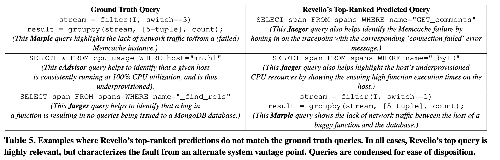

The motivation is that manual debugging is very time-consuming. Though there are a lot of specialized debugging tools for different subsystems or types of faults (cAdvisor, Marple, Jaeger), it is difficult to decide which subsystem to query and how to set query parameters.

Recurring categories of root causes are of the majority. Thus it should be helpful to recommend queries based on historical reports and queries.

*But in this work, deciding the query parameters is almost equal to deciding which subsystems to query.*

This paper proposes a supervised model to predict the best queries based on the user report of a bug (i.e., an issue report, a ticket) and system logs (i.e., actually metrics). Note that this work focuses on faults in recurring categories (perhaps new location) only.

This paper set up three testbed systems, injected faults in them, and collected user reports of bugs via a crowdsourcing platform. The top-5 recall of correct queries is nearly 100%. This paper also provides an end-to-end debugging experiment from 20 volunteers. 

## Methodology

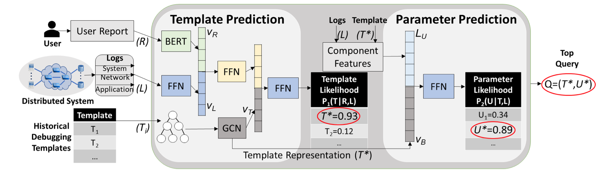

#### Input Data

The input of Revelio contains a user report and system logs.

A user report is an arbitrary text.

A system log is condensed and featured (e.g., min, max, average, median) time-series data from metric collectors (e.g., packet count, queue depth, execution latency, CPU utilization, memory utilization, disk throughput).

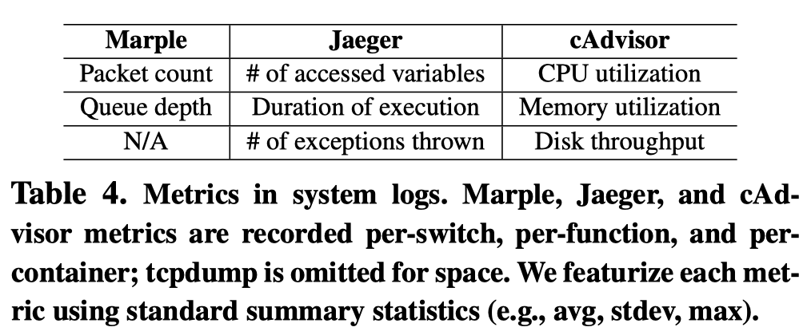

A query is a structured text, which can be represented by an AST (abstract syntax tree).

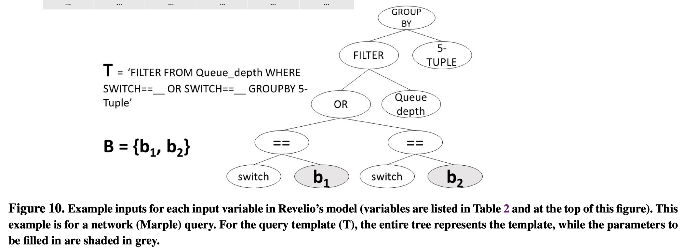

#### Model Factorizing

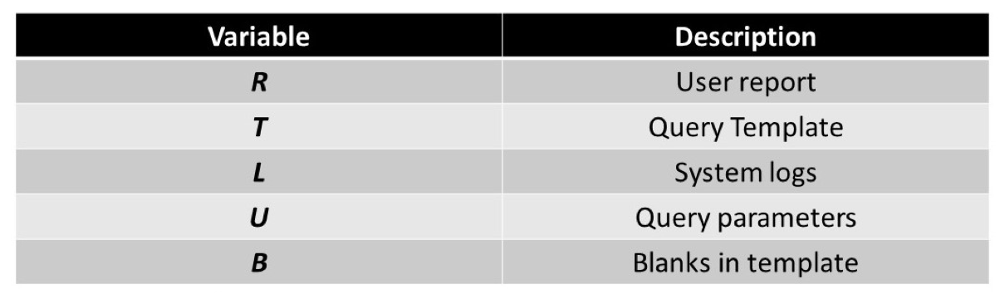

The target distribution

$$
P(Q|R, L)
$$

To reduce the search space, Revelio factorizes the model into two steps:

$$
P(Q|R, L)=P(T|R, L)P(U|T, R, L)
$$

In other words, Revelio firstly predicts the query template (the categories of the faults) by the user report the system logs. Then Revelio fill the blanks in the template.

To simplify the model further, Revelio assumes that query parameters are independent with the user report:

$$
P(U|T,R,L)=P(U|T, L)
$$

And filling the blanks can be further factorized:

$$
P(U|T, L)=\prod_{u_i\in U} P(u_i|b_i, T, L)
$$

#### Predicting Query Templates

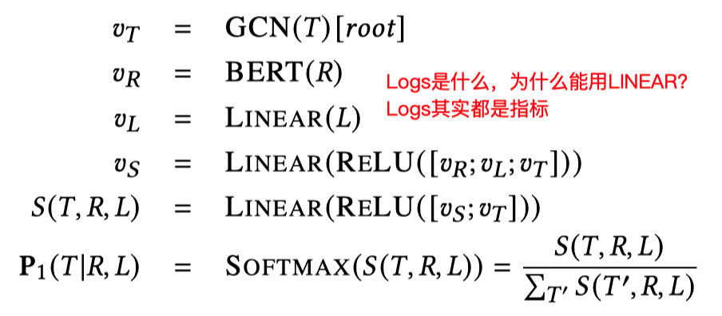

#### Predicting Values to Fill
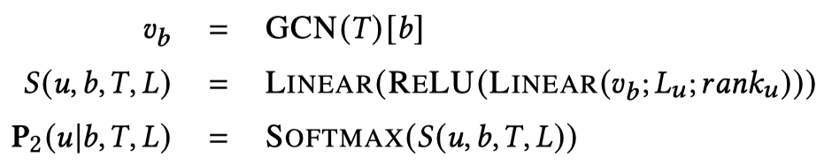

## Evaluation

#### Setup

Testbed:

1. Reddit (monolithic)
2. Sock-Shop
3. Hipster-Shop

Orchestration: containernet

Monitoring: cAdvisor, Jaeger, Marple, tcpdump (for query only, no system logs)

Fault injection:

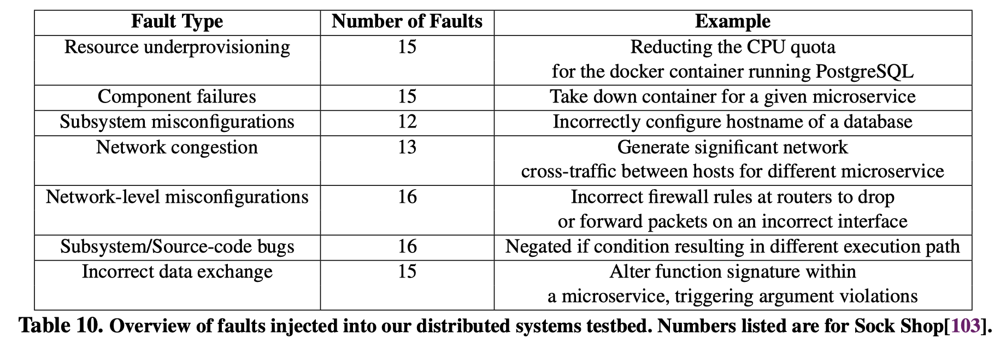

User reports: Amazon Mechanical Turk (a crowdsourcing platform)

#### Overall Performance

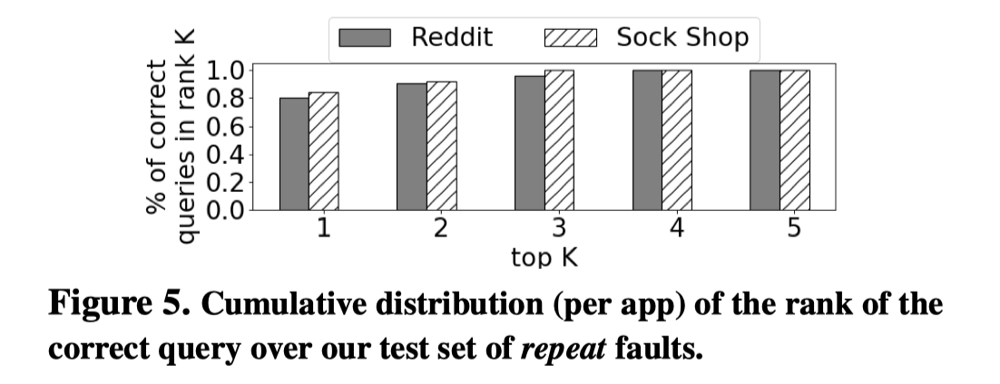

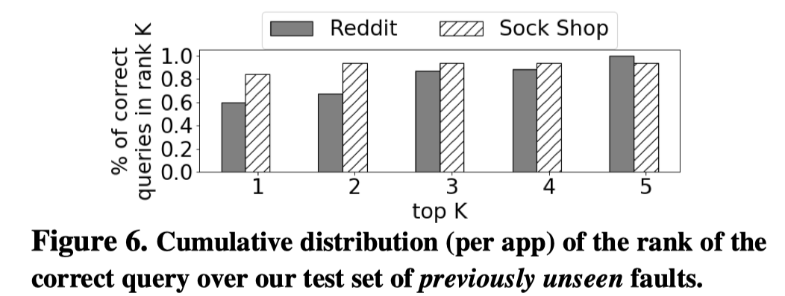

The top-r recall is high in both recurring and unseen (recurring categories with new locations) faults.

#### Ablation Experiment

###### User Report

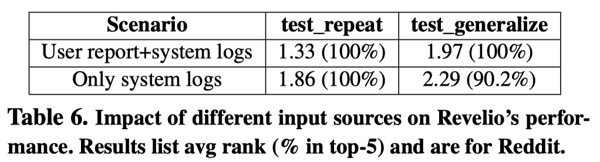

###### Multiple Tool vs Single Tool

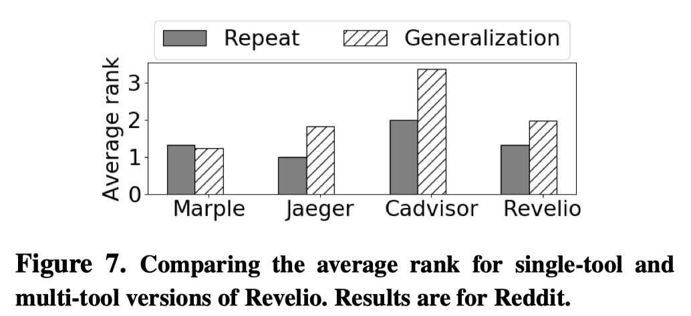

The performance combining multiple debug tools is worse than single tools since the latter has narrower search space for query templates.

###### Model Structure

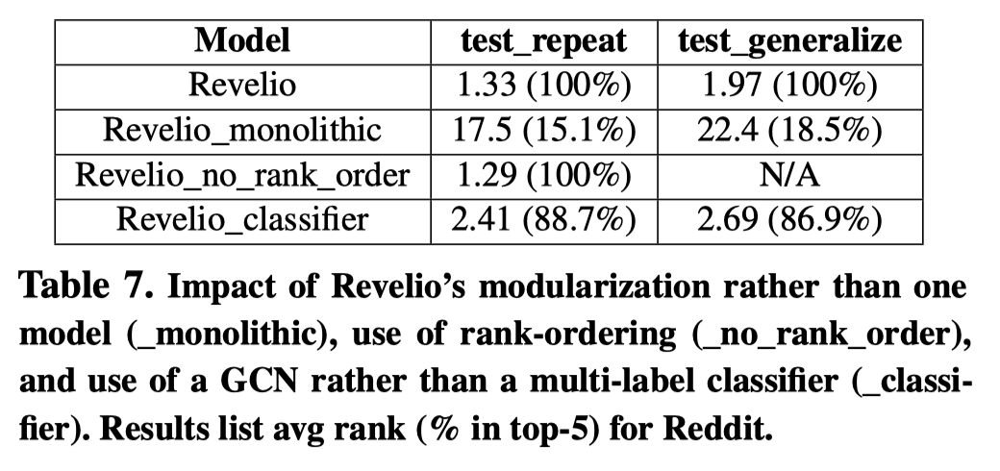

## Thinking and Conclusion

To reduce search space, Revelio factorizes the target output into two steps. It is widely used by other works such as FIRM

[FIRM An Intelligent Fine-grained Resource Manage](./FIRM%20An%20Intelligent%20Fine-grained%20Resource%20Manage.md) 

Revelio uses GCN to represent a AST formatted query. It is better to utilize the structure for structured texts. For unstructured texts (user reports), Revelio uses BERT.

Use ordering for generalization. It is interesting. But the experimental result  seems not very convincing.