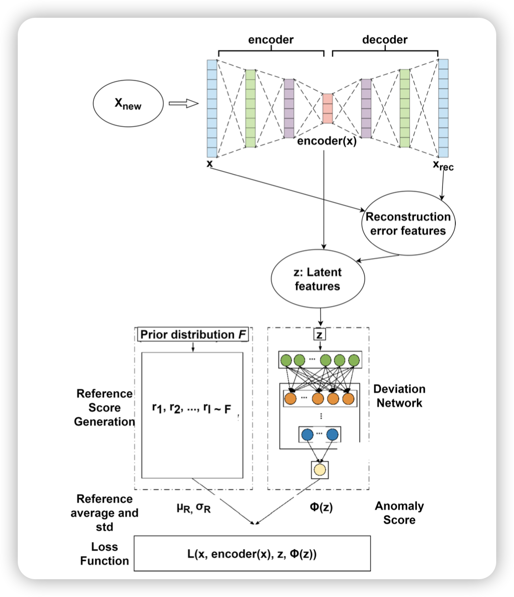

这篇文章聚焦于日志解析。之前的日志解析工作存在两个不足：

1. 效率。在实际生产环境中，日志的数量是极其巨大的，因此分布式地处理日志是必不可少的。但是，如果简单地将日志随机分配到不同的executor上，那么那些本来属于同一template的日志就会由于context的不同，得到不同的解析结果。因此，一般我们希望尽可能将属于同一template的日志分配到同一executor上。基于prefix-token可以快速实现这种分配，但是由于不同template的日志数量差别极其不平衡，简单如此会导致耗时最长的executor会主导整体的耗时。
2. 更新。日志的模式可能是在不断变化的，因此最好需要基于用户反馈去不断更新模型

这篇文章提出的SPINE方法解决了以上两点不足。首先，和以往的log parsing工作一样，SPINE需要对日志做preprocessing。

然后，SPINE会首先把所有的日志通过prefix token方法快速分成不同的log group。然后，我们希望把这些log group分配到不同的executor去并行处理。为了处理不同log group可能大小极其不平衡的问题，SPINE会拆分过大的log group使得每一份有差不多平均大小，打包太小的log group，以尽可能让不同的executor上负载均衡。

之后，在每一个executor上，SPINE通过一个progressive clustering算法进行模板提取。对于每一个node，需要判断是不是要将其分裂成两个node。分裂的方法是对所有日志的vector representation执行一个聚类算法（比如k-means）。判断是否需要分裂的标准是node中日志的平均饱和度（Saturation）。一条日志的饱和度定义为其中饱和token的比例。饱和token（saturated token）定义为在当前node的所有日志中出现过的token。

在叶结点上，饱和token就是template，剩下的就是parameters

在在线解析时，SPINE通过计算每个日志和当前所有cluster的template的相似度进行分配。对于相似度过低的日志，会被标记为unmatched并后续进行新的聚类。

用户反馈是在离线阶段进行的。为了做到user-friendly，用户反馈时只需要回答两个两组日志是 or 不是属于同一个模板就行了。如果不是，那么SPINE会取消这次分裂。为了更高效地选择给用户提供的query，SPINE会计算saturation gain。Saturation gain高的节点以为这其分裂会带来更高的准确率提升，因此会优先询问。

SPINE在若干个公开数据集上进行了评估。主要评估了性能（和并行话和feedback无关，都不使用），user feedback 性能 （使用不同数量的feedback能带来多少性能提升），并行效率。

最好还在实际系统中有验证。

虽然******这篇文章中的技术看起来都比较基础，但是整个系统非常完整，解决了两个实践中会遇到的挑战，非常实用，最终的评测也很solid，而且确实效果不错。******