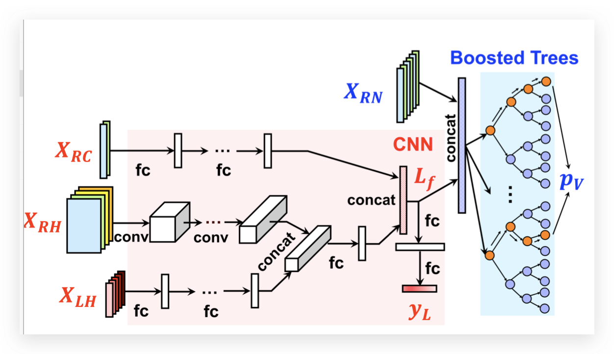

## Introduction

用CNN预测当前在给定资源情况下的微服务latency以及整体的QoS是不是超标

## Methodology

通过当前的资源利用率，历史的资源利用率以及latency，预测当前的延迟

boost tree用来预测是不有QoS violation

通过这个模型，我们可以：

- 在线指导资源的分配，比如给每个微服务分配多少核
- 通过LIIME解释模型，确定根因（对latency影响大的维度就是根因）.

## Evaluation

## Thinking and Conclusion

和Sage其实比较像，都是通过一个模型去建模系统的latency和资源的关系。

和Sage的不同之处主要有：

- Sage建立了一个CBN模型，而这里直接用了一个CNN，没有嵌入任何领域知识
- Sage没有考虑历史状态的影响，而Sinan是使用了历史资源使用率和latency的。当然把这些加入Sage也比较直接，没有真正的挑战。

[Sage Leveraging ML To Diagnose Unpredictable Perfo](./Sage%20Leveraging%20ML%20To%20Diagnose%20Unpredictable%20Perfo.md)