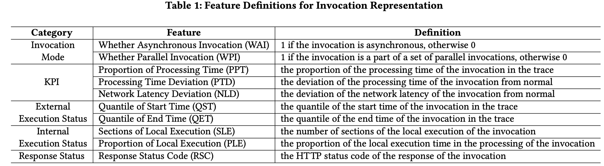
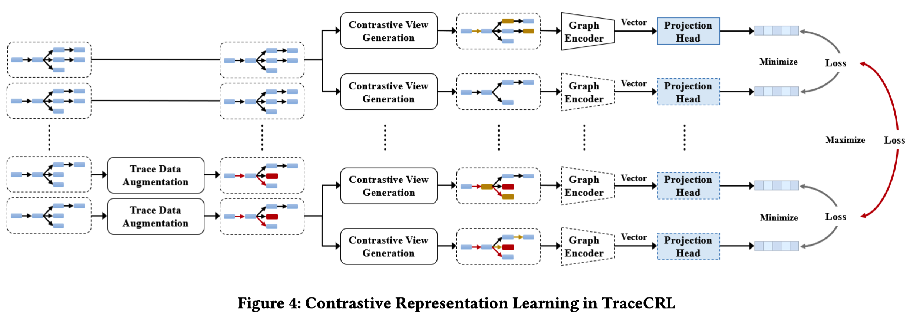
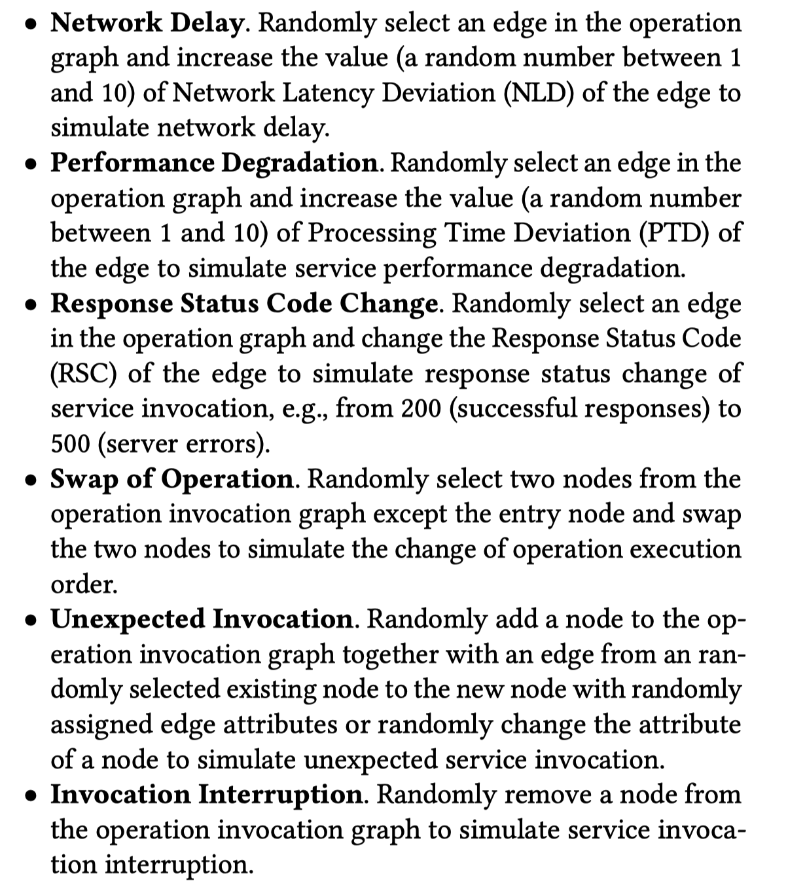
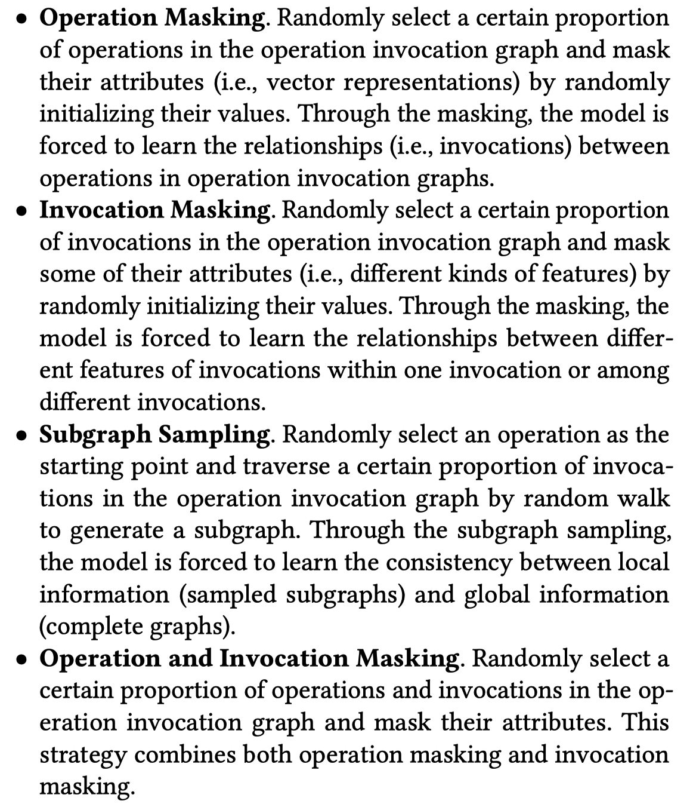

这篇文章聚焦于对trace进行表示学习，学到的representation vector可以用于下游任务（比如trace anomaly detection和tail-based trace sampling）。已有的方法会从trace中提取一些预定义的features（例如MEPFL），或者枚举trace中出现的结构来对结构进行编码（例如TraceAnomaly）。这些方法的准确性都依赖这些预处理，本文希望能直接学习trace的图结构。

**我理解graph embedding确实比现有的方法更好，但是论文里的理由说得不是很明确。MEPFL这类方法实际上没有编码trace的图结构。TraceAnomaly这类方法是枚举了所有已经见过的subgraph结构，但是直接用这种类似one hot的编码会导致embedding的维度过高，而且不能处理没见过的新结构。**

为了学习trace的representation，有以下几个问题：

- 如何将trace表示为graph
- 如果编码图上的node和edge（optionally），即如何得到node features和edge features
- 如何进行表示学习，即我们学embedding的目标是什么

#### 如何将trace表示为graph

这边文章提出了一种叫operation invocation graph（OIG）的表示。一条trace表示为一个OIG，图上的节点表示service operations，边表示invocations。注意，这里的invocation和span不是一个概念。一般而言，一条invocation至少有两个span，一个是在callee service上的server-side span（s.operation是被调用的operation），一个是在caller service上的client-side span（s.operation是调用方的operation）。

*按我的理解，本文的方法章节中提到的span都是server-side span，client-side span中的数据已经被预处理进对应的server-side span中了。*

[https://github.com/FudanSELab/TraceCRL/issues/1](https://github.com/FudanSELab/TraceCRL/issues/1)

- 每一个root span（没有parent的span）代表从外部客户端发起的一次请求。所以我们创建一个虚拟的client节点，然后创建一个s.operation节点，用一条边连接起来。这条invocation的数据可能是缺失的，因为我们没有client端的数据。
- 每一个non-root span代表一个invocation。因此新建一个s.operation节点，并从s.parent.operation（*只要没有数据缺失，按拓扑顺序分析span，该节点就必然已经存在*）指向它。

*OIG相比于原始的span之间的图，做了非常适当的简化：主要是将server-side span和client-side span合并为一个invocation（由edge表示）。相比于以往工作（例如MEPFL），由保留了足够丰富的信息，没有丢弃调用同一个service的多次调用（OIG中一个operationName可能对应多个节点，如果它被多次调用的话）。*

#### 如何获取no*de features*

首先将OIG合并为一个调用关系图（节点是operation，每个operation仅出现一次，边表示所有存在的调用关系），然后用DeepWalk获取node embedding

#### 如何获取e*dge features*

编码了一系列features：

#### 如何学习embedding

目标是希望相似的trace在latent space距离近，不相似的trace在latent space距离远。*这非常合理。那么如何判断trace是不是相似呢？*

这篇文章采用了constrastive learning的方法，对于真实数据中的训练样本（traces），通过augmentation方法构造positive（相似trace）和negative（不相似trace） samples。所以如何判断trace是否相似就隐含在两类augmentation方法中了。

 

构造不相似的trace主要是通过模拟异常的方式进行的：

构造相似的trace（准确说是trace的表示）主要是通过masking的方式进行的。Masking仅仅掩蔽features，结构是保留的。而其中的第三种方式，subgraph sampling，是连结构一起去掉。

**********************************************************************************************************************************************Subgraph sampling是不是会和上面的invocation interruption比较像呢？我理解还是有一些区别的，subgrapgh sampling至少仍然保证了往上游服务的random walk sequence还是一致的，所以DeepWalk给出的embedding可能变化会比较小。**********************************************************************************************************************************************

#### 实验

主要基于Train-Ticket和注入故障收集的数据集。这里的一个主要挑战可能是如何标注anomalous traces，但是这篇文章并没有细说，只是引用了一些工作，也包括了我们之前的工作（TraceRCA）。TraceRCA标注的方式是，我们仅注入了会导致某一个组件（服务/API/container）上的所有trace 100%发生异常的故障，然后将所有进过该根因组件的trace都自动标注为异常。如果是有概率使trace异常的故障，我理解就很难标注了，需要引入一些简单的指标异常检测才行，但是这样就会出现用简单异常检测方法给复杂方法做标注的矛盾。

实验主要是评估了两个下游任务：trace anomaly detection和tail-based sampling。

Abalation study主要分析了有没有augmentation（仅指生成negative sampling那一部分）的影响。*但是我觉得我比较好奇、可以去做abalation study的还有很多，比如invocation features的重要性，DeepWalk方法，不同的augmentation方法等等。当然确实篇幅放不下这么多了。*

#### Discussion

我觉得TraceCRL整体上是一个很好的方法，整个方法流程比较新颖，也很完整，对trace anomaly detection和sampling都会很有帮助。但是主要问题可能是，我个人认为trace anomaly detection本身其实价值有限，更重要的是为后续的trace-based root cause analysis提供帮助。因为故障发现有很多更好的手段，trace anomaly detection单纯来做故障发现性价比极低。那么基于TraceCRL的embedding进行异常检测，能不能对后续的根因定位有帮助呢？我觉得根因定位可还需要trace上每个invocation的异常检测结果。TraceCRL可能是可以做的，因为它也可以输出对operation的embedding，但是目前该论文没有分析这一块。